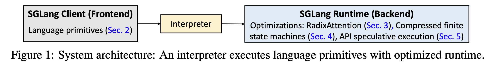
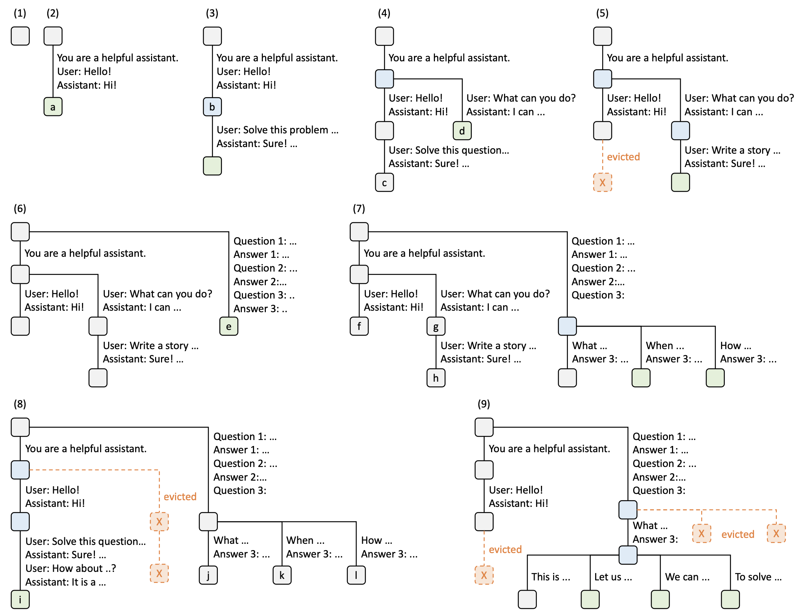
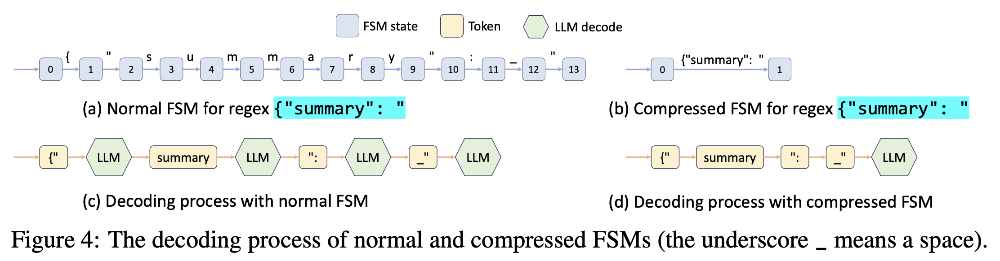

原文见我的飞书：[https://et1q7qdh0g.feishu.cn/wiki/PX23wVVN7ivWCUk4KFvcQAcDn0d?from=from_copylink](https://et1q7qdh0g.feishu.cn/wiki/PX23wVVN7ivWCUk4KFvcQAcDn0d?from=from_copylink)

## 什么是 SGLang？

SGLang （https://github.com/sgl-project/sglang）源于 *SGLang: Efficient Execution of Structured Language Model Programs （https://arxiv.org/abs/2312.07104）*&#x8FD9;篇 paper，代码应该是 2023 年 10 月份开始开发的，paper 则是 2023 年 12 月份放出来的。

在业界的使用上来讲，SGLang 给人的感觉和 vLLM 是同一类的工具：用于大模型推理，但是从原始 paper 的角度来看，SGLang 会比 vLLM 多了一个前端编程模型部分。

所以 SGLang 是什么意思？它的全称是什么？

SGLang 的全称是 **S**tructured **G**eneration **L**anguage，他是一个为高效执行结构化语言模型程序而设计的系统，主要包含两个部分：

1. 前端语言：用于简化 LLM 程序的编写，提供生成控制原语（Primitives）

2. 后端运行时：用于优化执行效率，这也就是实际做大语言模型推理的部分



其主要的创新点有以下三点：

1. RadixAttention for KV cache：使用基数树（Radix Tree）来自动复用 KV cache

2. Compressed Finite State Machine for Constraint Decoding：使用压缩有限状态机来加速约束解码（Constrained Decoding），允许一次解码多个 token

3. API Speculative Execution：通过预测来减少 API 调用的成本

其编程模型则提供了如下原语：

* 用于生成：gen（生成）, select（选择）, extend（扩展）

* 用于并行控制：fork（分叉）, join（合并）等。

## 为什么有 SGLang？

作者们主要为了解决以下两个问题：

1. 语言模型编程的复杂性：LLM 本身的输出是不确定的，需要调节各种 prompt，处理并行机制等等

2. 语言模型执行的低效性：有很多重复计算，比如共享相同前缀的请求其实是可以共享 KV cache 的；加快结构化输出（比如要求输出 json）的速度等

对于第一个问题提出的解决方案就是设计基于 Python 的 DSL（Domain Specific Language）前端；对于第二个问题解决方案则是后端运行时，包括 RadixAttention 以及 Compressed Finite State Machine 优化。

正如前面所说，SGLang 经常和 vLLM 放在一块进行讨论，SGLang 在 2023 年底出现，而 vLLM 则在 2023 年 1 月份就开始开发，并且观察一下作者会发现其中一波人是重复的，一作都来自 UCB，SGLang 可能是很想强调他的前端这部分，但是随着发展，其后端推理部分所扮演的角色越来越主要（我怀疑很可能这个前端没什么人在用...）。

因此，下面会略掉前端，重点讲后端。

## 什么是 RadixAttention？

RadixAttention 使用了 radix tree 来使相同前缀的文本共享他们的 KV cache，是 SGLang 的标志性工作（正如 PagedAttention 是 vLLM 的标志性工作一样）。

什么是 radix tree？首先说一下 trie，trie 是一种树形结构，树上的每个节点对应一个字符，从树的根节点出发，走到叶子节点的路径就形成一个字符串，我们可以发现，假如两个串有相同的前缀，那么他们在树上会有一部分祖先是共享的。而 radix tree 也是一种树形结构，和 trie 不同的是，radix tree 的每一个节点会对应一串字符，从而可以减少树中节点的数目。

对应到 LLM 推理来说，radix tree 上的每个节点则对应了一连串 token（以及这段 token 所对应的 KV cache），paper 中的示例如下：



上面这个图里实际上还包含了 LRU（Least Recently Used）驱逐机制，也就是当一块 KV cache 不再被任何地方引用的时候，并且显存不够用的时候，就将最近最少使用的叶子结点对应的 KV cache 给驱逐掉。这里的驱逐就是指的完全从 GPU vRAM 里删掉，而不是 offload 到 CPU 上。假如之后又确实需要这部分 KV cache 怎么办？重新计算一遍。

此外 paper 里还提出了 "Cache-aware scheduling"，这个讲的就是处理请求优先级的问题，假如有一堆请求在等待队列中等待处理，由于缓存的存在，假如我们交替处理两个共享了比较多前缀的请求，那么缓存命中率会比较高，但是如果交替处理两个完全不同的请求，就会导致缓存无法被复用。因此确定处理请求的顺序很重要，paper 提出了可以将所有请求按照匹配前缀的长度进行排序，然后按照匹配前缀的长度从长到短依次执行。

所以这里相当于牺牲了一部分请求先来先服务的严格顺序保证，从而换取了更好的缓存命中率，以提升系统的吞吐量并改进平均响应时间。

Paper 中还给出了一个定理：

> 对于一批请求，可以通过对这批请求构成的 radix tree 做深度优先遍历处理，从而达到最优的缓存命中率，并且缓存大小只需要 $$\ge$$ 最长的请求长度即可。而上面说到的按照匹配前缀的长度从长到短依次执行（longest-shared-prefix-first order）则等价于深度优先搜索的顺序。

这个定理主要说的是离线的批处理，也就是说我们预先知道了都有哪些请求需要处理，但是实际情况下更多是各种请求依次到来的在线情况，这里仍然可以去对深度优先搜索序做近似以达到比较好的调度效果。

Paper 的附录给出了 Cache-Aware Scheduling for RadixAttention with Continuous Batching 的伪代码，下面简单翻译为对应的 Python 代码：

```python
def cache_aware_scheduling(T: RadixTree, P: MemoryPool, B: Batch, 
                                         Q: WaitingQueue) -> FinishedRequests:
  # 从等待队列中获取所有请求
  requests = Q.get_all_requests()
  # 为每个等待请求查找前缀匹配
  for req in requests:
    # 返回的这个 prefix_node 实际上指向 radix 树的某个节点，
    # 这个节点是他匹配的最长前缀在树中的最后一个节点
    req.prefix_node, req.prefix_len = T.match_prefix(req.input_tokens)
  # 按照匹配前缀的长度逆序排序
  requests.sort(key=lambda req: req.prefix_len, reverse=True)
  # 这里的 available_size 表示的是为新的请求可以分配的最大显存数，包括
  # 1. radix tree 中可以驱逐的显存量
  # 2. 当前内存池中还可以使用的显存量
  available_size = T.evictable_size() + P.available_size()
  current_size = 0 # 用来记录当前批次所使用的显存大小
  new_batch = [] # 记录当前批次的请求
  for req in requests: # 遍历所有请求
    # 这里的 req.size() 其实是计算出来的这个请求所需要的 KV cache 大小
    if req.size() + current_size < available_size:
      new_batch.append(req)
      # 下面这个 delta 应该一直都是负的，当一个节点的引用计数从 0 变到 1，
      # 这个节点会从可驱逐变成不可驱逐，导致 available_size 会变小
      delta = T.increase_ref_counter(req.prefix_node)
      available_size = available_size + delta
      current_size += req.size() # 原 paper 伪代码里应该少了这一行
  Q.remove_requests(new_batch) # 从等待队列中移除选中的请求
  B.merge(new_batch) # 将新请求合并到当前批次
  # 分配显存
  needed_size = B.needed_size()
  success, buffer = P.alloc(needed_size)
  if not success:
    T.evict(needed_size) # 显存不够的话就驱逐
    success, buffer = P.alloc(needed_size)
  B.run(buffer) # 处理请求
  finished_requests = B.drop_finished_requests()
  for req in finished_requests: # 去掉已经执行的请求
    T.decrease_ref_counter(req.prefix_node)
    T.insert(req)
  return finished_requests
```

这里有两点需要注意：

1. 原 paper 应该是少了一个 current\_size += req.size()

2. 我们会发现当请求执行完之后才会有一个往 radix tree 中进行插入的操作 T.insert(req)，这是因为请求执行完之后该请求的 KV cache 都已经构造好，可以放到 radix tree 中以供后面的请求进行复用

整个实现的核心逻辑是先对所有请求在 radix tree 中找最长前缀，然后按照前缀长度排序，再按降序往批次里面添加，执行完之后再把完成请求的 KV cache 添加到 radix tree 当中。

前面不还有个定理吗，就是说在 radix tree 上走 DFS（depth-first search）的时候能达到最优缓存命中率，不妨来看看是怎么证明的：

首先令 $$R$$ 为批次中的请求，$$T$$ 为从 $$R$$ 构造出的 radix tree，对于 $$T$$ 的每一条边 $$e$$来说，和他相关的 KV cache 至少要计算一次，令 $$\vert e\vert$$ 为 $$e$$ 对应的 KV cache 的大小，令 $$C$$ 表示计算 $$R$$ 的 KV cache 所需要的计算复杂度，那么我们可以得到一个下界：$$C\ge\sum_{e\in\text{edges}(T)}\vert e\vert$$，然后考虑对这个 radix tree $$T$$ 做 DFS，当我们第一次访问并计算 $$e$$ 的 KV cache 之后，我们会在接下来持续访问 $$e$$ 的子树，在计算 $$e$$ 的子树所对应的 KV cache 时，$$e$$ 所对应的 KV cache 会不断地命中，从而不会产生额外的计算开销，当 $$e$$ 的子树计算完毕之后，$$e$$ 本身不会再被用到，因此他对应的 KV cache 可以被放心驱逐，并且此时我们可以注意到，当 cache size $$\ge$$ 最长请求长度时，在计算 $$e$$ 的子树 KV cache 时，$$e$$ 本身一定不会被清除，因此每条边 $$e$$ 对应的 KV cache 实际上只会被计算一次，于是我们可以达到这个下界 $$C=\sum_{e\in\text{edges}(T)}\vert e\vert$$ ，而缓存命中率同时达到其上界：

$$\begin{align}
\frac{\sum_{r\in R}r 中命中缓存的\text{ token }数}{\sum_{r\in R} r 中所有的\text{ token }数}=1-\frac{C}{\sum_{r\in R} r 中所有的\text{ token }数}
\end{align}$$

接下来可以通过归纳法证明算法中的 longest-shared-prefix-first 的实现是等价于 DFS 处理序的：

* 基础情况：在开始的时候，由于没有任何缓存，因此执行一个随机请求等价于计算 $$T$$ 上的从根出发的一条路径所对应的 KV cache，此时这个路径相当于初始的一个 DFS 序，此时这条路径被缓存起来

* 归纳假设：假设我们刚刚访问了 $$T$$ 中的节点 $$y$$，其到根节点的路径是 $$P$$，并且已经访问的节点符合 DFS 序，那么所有还没有访问到的节点都和 $$P$$ 上的节点有着最近公共祖先的关系，由于 $$P$$ 上的节点都已经缓存过来，那么假如节点 $$z$$ 到根节点的路径和 $$P$$ 有最低的最近公共祖先，并且他没有被访问过，那么 $$z$$ 对应的路径和 $$P$$ 有着最长公共前缀，并且是一个合法的 DFS 序。$$\square$$

## 什么是 Constrained Decoding？

SGLang 还有另一个关键的贡献是使用 Compressed Finite State Machine 来优化 Constrained Decoding，之前有很多讨论是为什么让 LLM 生成正确的 JSON 非常困难，因为 JSON 是一种带约束的（Constrained）、结构化的输出，有任何的错误都会导致 JSON 是无效的，而 LLM 的输出是概率分布，具有随机性。并且这里其实还和 tokenizer 有关，JSON 中包含 \`{\` \`"\` \`:\` 以及各种空格，导致 tokenizer 切出来各种各样的 token，使得语义容易有偏差。并且训练数据中可能不一定有完美的 JSON，模型不一定能学会完全正确的 JSON 格式。

SGLang 使用正则表达式来对输出进行约束，现有的一些做法会把其转换为有限状态机（Finite State Machine, FSM）来进行实现，在解码的时候维护当前在 FSM 上的状态，然后获取下一个状态所允许的所有合法的 token，将所有不合法的 token 对应的概率都置为 $$0$$，这种做法的局限性在于每次只能解码一个 token，比如下图中的 {"summary": " 通常会解码成多个 token，但是在 JSON 中其实也就是一个语义单元：



SGLang 设计了一个约束解码运行时，来分析 FSM 并且 FSM 中相邻的只有单向转移的边进行压缩，从而使得一次可以 decode 多个 token。

此处值得额外再展开细细梳理，可以参考阅读 https://lmsys.org/blog/2024-02-05-compressed-fsm/

## 什么是 API Speculative Execution？

这一点是原 paper 中的第三点贡献，不过这个比较简单，大概说的就是 SGLang 可以帮你在调用闭源模型 API 的时候减少调用次数，SGLang 在首次调用的时候会忽略原本设置的停止条件（比如遇到 '\n' 就停止），让模型继续生成更多的内容，然后 SGLang 看用户接下来的输入是否可以复用这些已经生成的部分。

## 总结

总的来说 SGLang 原 paper 最大的亮点是 Cache-Aware Scheduling for RadixAttention，其中 cache-aware 这一点是 vLLM 在 Paged Attention 中所没有的，而 Radix Attention 和 Paged Attention 在某一些方面会有相似性，比如都在想办法优化 KV cache，Radix Attention 是在复用公共前缀的 KV cache，Paged Attention 是在将 KV cache 切成 block 来减少内存碎片以提高 GPU 显存利用率，目前的 SGLang 和 vLLM 发展趋势应该是不断的互相学习，特性互通有无的状态。

