原文来自于我的飞书：

[https://et1q7qdh0g.feishu.cn/wiki/B1lzwgUeIiJ8Agks1YTc5blOnHg?fromScene=spaceOverview](https://et1q7qdh0g.feishu.cn/wiki/B1lzwgUeIiJ8Agks1YTc5blOnHg?fromScene=spaceOverview)

## 什么是 Data Parallel？

随着我们需要训练的模型不断增大，模型可能没有办法塞到一张 GPU 里面，即使我们想办法通过激活值重计算或者梯度累积来减少激活值的显存占用量，有可能是模型参数本身就无法放到一张 GPU 内，比如对于 70B 的模型，采用BF16+FP32 混合精度训练时至少要消耗 $$70\times 16$$ 的显存（这里假设不存储梯度 FP32 副本），因此是时候考虑将模型扩展到多机上了！

所谓的数据并行（Data Parallel），说的就是将模型分散到多卡上进行训练，但是这里我们还是首先看模型可以塞到一张 GPU 里面的情况 😅，最简单的数据并行，就是把模型的参数和优化器状态原封不动地复制到多个 GPU 上，然后为不同的 GPU 放置不同的数据（micro batch），不同的数据在不同的卡上各自做各自的前向传播和反向传播，等所有 micro batch 的反向传播算出来梯度之后，再执行 all-reduce 来计算这些所有 micro batch 的平均梯度，然后用这个梯度去更新模型参数和优化器状态。

如下图所示：

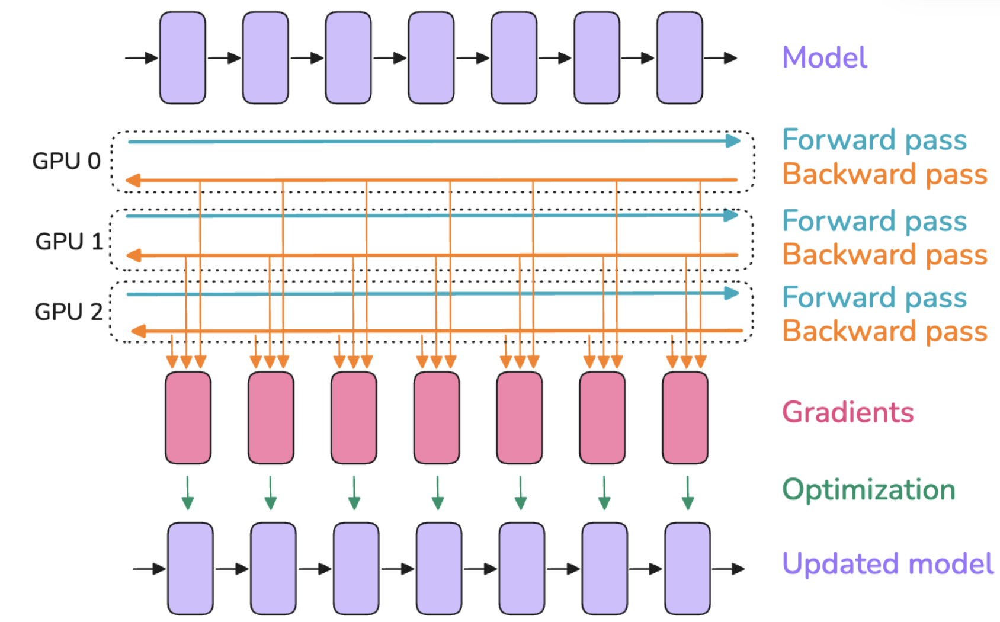

所谓的 all-reduce 就是将各个 GPU 的数据经过一个 $$f$$ 函数（在这里就是求平均）进行计算，然后把计算结果再分布到所有 GPU 上，如图：

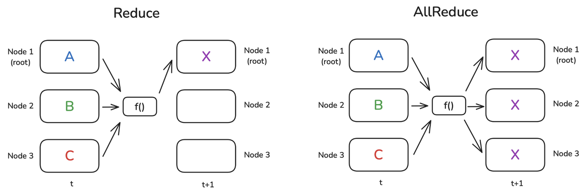

这里我们对比下多卡和单卡，发现多卡这里会多一个这样的 all-reduce 通信，这意味着，每个 micro batch 计算完之后，GPU 需要互相等待同步，之后才能一块开始下一轮的训练，计算与通信的时序如下：

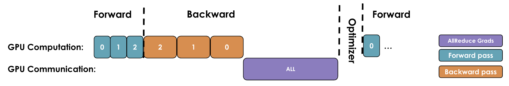

这里的一个常见的优化思路其实是将计算和通信进行重叠，上图中我们可以看到 all-reduce 操作其实可以和反向传播同时执行，当反向传播每计算完一个参数的梯度之后，这个参数的梯度就可以开始执行 all-reduce 操作了，如下图所示：

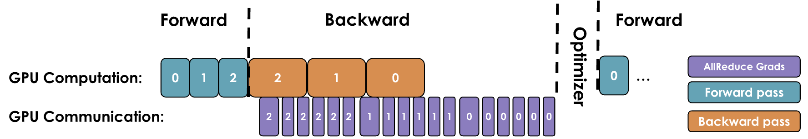

但是就像系统调用一样，通信原语 all-reduce 本身执行的开销就比较大，所以如果每个参数都执行 all-reduce，就会执行非常多次的 all-reduce，一个很自然的想法是将梯度分块，按块来执行 all-reduce，如下图所示，我们可以将梯度分为三块，每块计算完梯度之后执行一次 all-reduce，这样的话总共就只需要三次 all-reduce 操作：

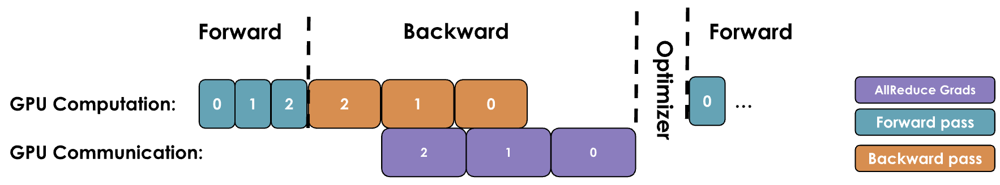

此处数据并行还可以和梯度累积（gradient accumulation）相结合，结合的时候需要注意，只用在 gradient accumulation 的最后一步进行 all-reduce 即可，前面的 accumulation 步骤中可以通过 pytorch 的 `model.no_sync()` 来避免梯度同步。

同时使用了数据并行以及梯度累积之后，我们的实际 batch size 可以进行相应扩展：

$$bs=gbs=mbs\cdot grad\_acc\cdot dp$$

其中 $$bs$$ 表示 batch size，$$gbs$$ 表示 global batch size，$$mbs$$ 表示 micro batch size，$$grad\_acc$$ 表示梯度累积的步数，$$dp$$ 表示数据并行的组数。

因此当我们确定了我们期望达到的 batch size 之后，然后我们可以评估我们手上有多少张 GPU，每张 GPU 可以塞多少 micro batch size，从而计算出来梯度累积的步数（步数无限大可以达到无限的 batch size，但是训练会变慢）

> 如何确定我们期望的 batch size 的大小？现在的 LLM 通常计算的是 batch size tokens，也就是 batch size 乘上序列长度的大小，一般是 4M 到 60M 的 token 数，并且一般来说，batch size 越大越好（梯度会更加稳定），像 llama1 的 batch size tokens 是 4M，训练的总 token 数是 1.4T，而 deepseek 的 batch size tokens 是 60M，训练的总 token 数是 14T

我们可以把数据并行看成是 1D 并行，之后还有张量并行（Tensor Parallelism），序列/上下文并行（Sequence/Context Parallelism），流水线并行（Pipeline Parallelism），专家并行（Expert Parallelism），从而总共构成 5D 并行。

那么接下来我们正式讨论一个模型无法塞到一张卡上的情况，此时我们需要引入 ZeRO 机制（类似于 pytorch 的 FSDP）。

## 什么是 ZeRO？

ZeRO 的全称是 **Ze**ro **R**edundancy **O**ptimizer，起源于 2020 年的 paper： *ZeRO: Memory Optimizations Toward Training Trillion Parameter Models，*&#x5BF9;应的实现是 deepspeed （https://github.com/deepspeedai/DeepSpeed），简单来说，他提出了三个 ZeRO 阶段：

* ZeRO1：将优化器状态分散到各个 GPU 上

* ZeRO2：将优化器状态和梯度分散到各个 GPU 上

* ZeRO3：将优化器状态、梯度和模型参数分散到各个 GPU 上（在 pytorch 中这个也叫做 FSDP, Fully-Sharded Data Parallelism）

为啥 ZeRO 要放在数据并行这部分来讲？因为 ZeRO 的本质仍然是数据并行，只不过一般的数据并行中，数据在多个卡上时不同的，模型在多个卡上是各自持有了同样的副本，ZeRO 则是在想办法减少数据并行过程中，模型本身的冗余显存开销，也就是说 ZeRO 本身不降低激活值的开销（这里 ZeRO 主要指 ZeRO1/2/3，在 paper 里统称 ZeRO-DP，paper 里还说了一个叫做 ZeRO-R 的部分，是在处理激活值的），而是专注于解决模型参数/梯度/优化器状态在数据并行时的冗余（其实在单纯的数据并行中，每个 GPU 上的数据是不同的，因此激活值也是不同的，这里激活值并不存在冗余，但是模型参数这些每个 GPU 则是有相同的部分）。

令模型总的参数量为 $$\Psi$$（和 paper 中的符号对齐），那么混合精度下：

* 模型参数消耗 $$2\Psi$$ 字节的显存（数据类型为 BF16 或者 FP16）

* 模型梯度消耗 $$2\Psi$$ 字节的显存（数据类型为 BF16 或者 FP16）

* 模型优化器状态消耗 $$8\Psi$$ 字节的显存（数据类型为 FP32，含有梯度的一阶矩和二阶矩）

* 模型参数的 32 位副本 $$4\Psi$$ 字节

* 模型梯度的 32 位副本 $$4\Psi$$ 字节（可选）

这里我们先不考虑模型梯度的 32 位副本，那么总显存占用为 $$2\Psi+2\Psi+12\Psi=16\Psi$$，其中模型副本可以和优化器状态归到一项中进行计算优化，因为模型副本的更新时机实际上和优化器状态的更新时机一致，那么我们可以得到论文中的这个图：

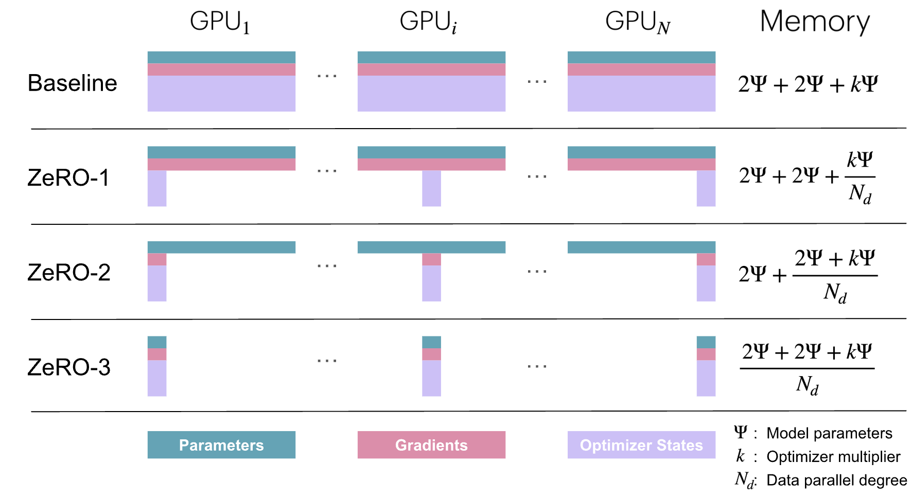

其中 $$N_d$$ 是数据并行的度数，首先我们考虑 ZeRO1，也就是将优化器状态（包括模型参数 32 位副本）分成 $$N_d$$ 份，每 $$\frac{1}{N_d}$$ 份存储到一个节点上，同样，每个节点也只存储了 $$\frac{1}{N_d}$$ 份的模型参数的 32 位副本，因此要做前向传播的第一步就是执行一下 all-gather，以在所有节点上获得模型的完整参数（先转成 BF16 然后 all-gather 以准备做前向传播）：

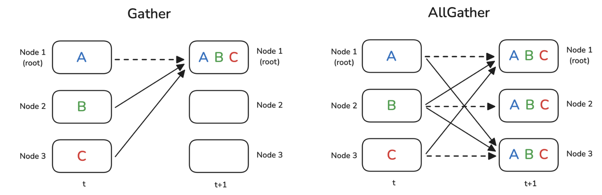

然后进行正式的训练步骤：

* 执行前向传播，此时使用的是全模型参数的 BF16 版本，每个节点都含有模型的全部参数，但是每个节点的数据不同

* 执行反向传播，每个节点存有模型所有参数对应的梯度，但是这些梯度值是由不同的数据算出来的

* 对梯度执行 reduce-scatter，从而将模型的最终的梯度分成 $$N_d$$份，每一份送到含有对应优化器状态的节点上

* 每个节点执行优化器操作，得到各自 $$\frac{1}{N_d}$$ 份的优化器状态以及 32 位的模型参数副本（转换成 BF16 以用于之后的前向传播）

* 然后再执行 all-gather 将转成 BF16 模型参数汇聚到所有节点上，准备执行下一次的前向传播

整体的流程图如下所示：

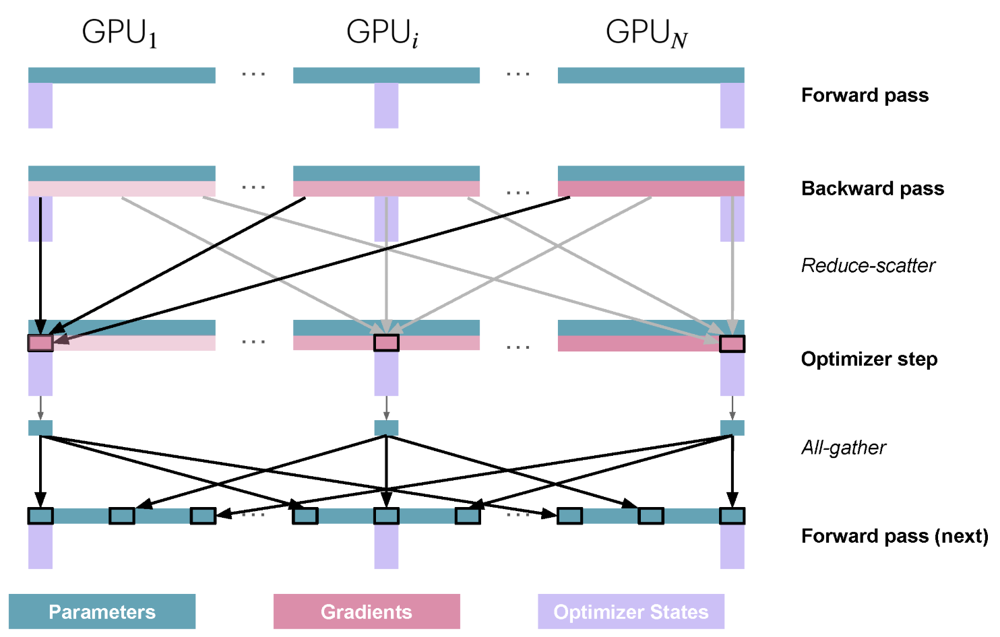

回忆一下普通的数据并行，只需要 all-reduce 操作，而 ZeRO1 是将 all-reduce 操作变成了 reduce-scatter，并且额外增加了一个 all-gather 操作，示意图如下：

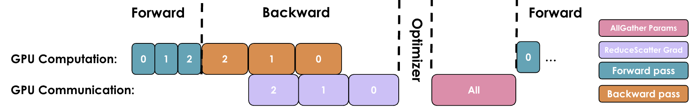

但是实际上 ZeRO1 和普通的数据并行相比并没有增加通信开销量，因为 all-reduce 一般是使用 reduce-scatter 和 all-gather 实现的（比如 ring-all-reduce）。

此处依然可以根据重叠计算与通信的思路进行优化，all-gather 这个通信操作可以尝试与计算进行重叠，比如在优化器状态更新的时候，更新一部分就执行一部分的 all-gather，再比如可以一边执行前向操作一边做 all-gather。

由于 ZeRO1 只分割了优化器状态，每个节点依然会保存所有参数的梯度，我们可以观察到每个节点更新优化器状态的时候其实只需要一部分梯度就行了，因此不需要的梯度可以在 reduce-scatter 之后直接释放掉，从而将梯度也做分割，如下图所示：

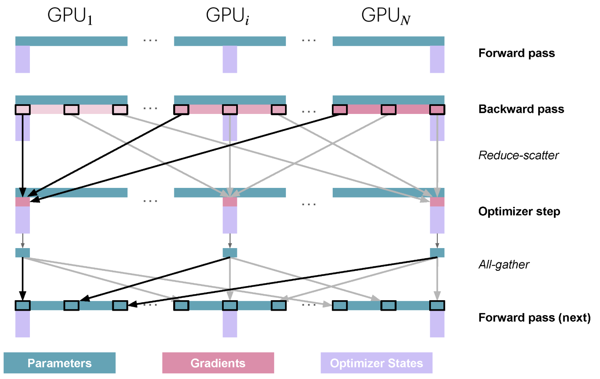

从图中可以发现，ZeRO2 和 ZeRO1 其实非常像，都是使用了 reduce-scatter 以及 all-gather 操作，他们相较于普通数据并行的通信量没有增加。

进一步我们可以将模型参数也进行分割，这就是 ZeRO3，在 pytorch 中也叫做 FSDP(Fully Sharded Data Parallelism)，当我们把模型参数也分散到多卡上时，每次前向传播的时候就需要执行一下 all-gather 来得到当前计算所需要的所有参数，如下图所示：

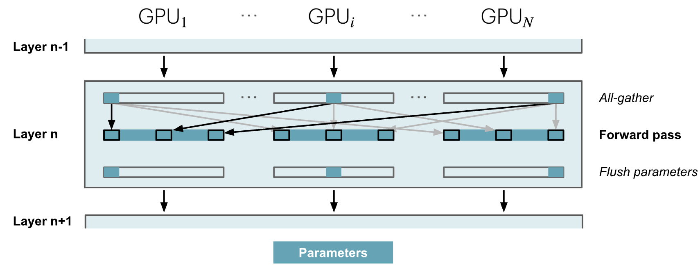

相当于计算到每一层的时候，先通过 all-gather 来获取所需要的参数，使用完之后立马丢弃他们。

当反向传播的时候同样需要先试用 all-gather 获取计算梯度所需要的参数，计算完梯度后则使用 reduce-scatter 来将梯度分散到各个节点上，如下图所示：

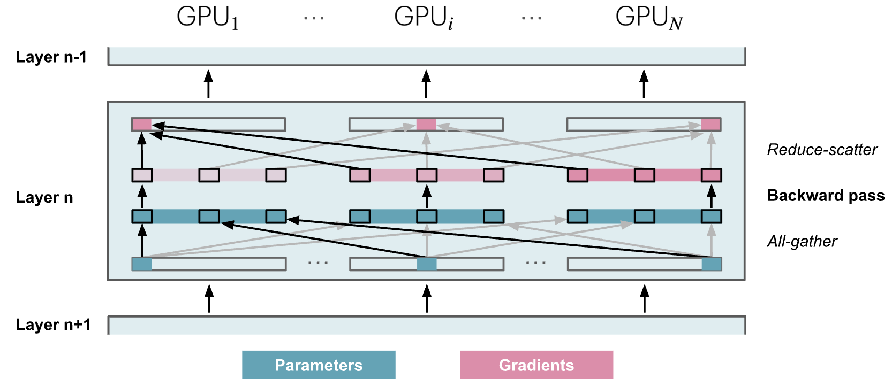

因此 ZeRO3 总共需要 $$2L$$ 次 all-gather，其中 $$L$$ 是层数，相比于 ZeRO2 增加了 $$2L-1$$ 次，导致引入了很大的通信开销：

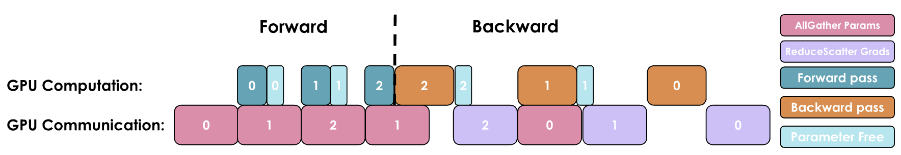

对于 ZeRO3 而言，前向传播的时候所有参数都会进行一下 all-gather，带来 $$\Psi$$ 的通信开销，而在反向传播的时候，所有参数同样会进行一下 all-gather，对应另外的 $$\Psi$$ 通信开销，此外还有反向传播时的 reduce-scatter 带来的 $$\Psi$$ 通信开销，因此 ZeRO3 的总通信开销量为 $$3\Psi$$，而对比一下 ZeRO2，只需要一开始的 all-gather 以及梯度的 reduce-scatter 即可，也就是 $$2\Psi$$。

在实践中，通信的开销可以通过 prefetching 来和计算做 overlap，但是一般来讲 ZeRO3 的速度相较于 ZeRO1/2 的速度会慢的很多。

