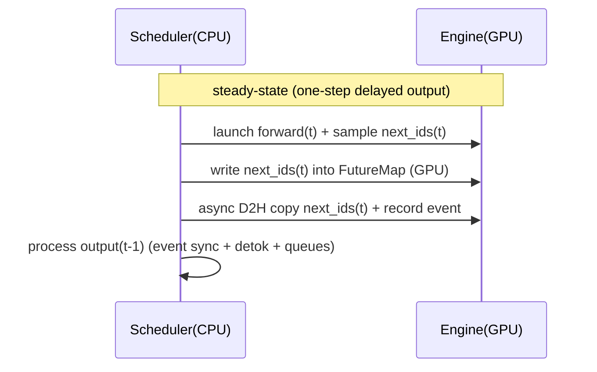

这篇只做一件事：**把 roseinfer 的 scheduler loop 做成 CPU/GPU overlap 的 pipeline**。

你可以把它理解成一句话：**每一步先把 GPU 的下一步 forward 发出去，再回头处理上一步的输出**，让 CPU 的“杂活”（同步、tolist、状态更新、detokenize/queue）尽可能不阻塞 GPU。

核心结论先放前面：在同一份 TraceA 的 online 压测下，开启 overlap 后，`TPOT/ITL/E2E` 的 tail 在重负载（scale=0.4）会明显下降；offline 吞吐也会有一档可测的提升（默认开，开关可回归）。

---

## 业界调研：SGLang / vLLM / TensorRT-LLM 的 overlap 都在 overlap 什么？

### 1) SGLang：FutureMap + “下一步占位 token” + one-step delayed output

SGLang 的 `Scheduler.event_loop_overlap()`（源码：[`python/sglang/srt/managers/scheduler.py`](https://github.com/sgl-project/sglang/blob/ea177372bd8cb12fca335291e81ef049b8655472/python/sglang/srt/managers/scheduler.py)）基本把思路写在代码里了：

1. 给当前 batch 分配一段“未来 token”槽位（`FutureMap.alloc_future_indices`）
2. 把 **未来 token 的 index** 写进 batch 的 `output_ids`（用负数表达 future index）
3. forward 完拿到 `next_token_ids` 后，把它写进 GPU 的 `FutureMap` buffer（`FutureMap.store_to_map`）
4. 下一步 forward 的输入里如果出现负数 token id，就用 `FutureMap` 在 GPU 上 resolve 成真实 token（`_resolve_future_token_ids`）
5. 结果处理（`process_batch_result_*`）被 **延后一个 iteration**：当前 iteration launch forward，同时处理上一个 batch 的输出

它的“狠”在于：**下一步 forward 不需要等 CPU 把 token id 搬回来**，因为 token 先留在 GPU 的 FutureMap 里，下一步直接在 GPU resolve。

### 2) vLLM：async scheduling + 专用 copy stream + pinned CPU buffer

vLLM 新版里更偏“工程化”：scheduler/runner 支持 async scheduling，并且显式搞了一条 `async_output_copy_stream` 来做 GPU->CPU 输出 copy（源码：[`vllm/v1/worker/gpu_model_runner.py`](https://github.com/vllm-project/vllm/blob/7b5575fa7dcf76ac86ab8d18501b9cc04f74f6bb/vllm/v1/worker/gpu_model_runner.py)）。

关键点是两个：

- **避免 `tolist()` 触发全局 stream sync**（critical path 上非常痛）
- **copy 放到独立 stream**，用 event 做协调，让 copy 和下一步 compute 尽量并行（硬件层面能吃到 copy engine 的 overlap）

### 3) TensorRT-LLM：overlap scheduler 是 executor loop 的默认能力

TensorRT-LLM（PyTorch executor 这条线）也有 `disable_overlap_scheduler`（默认不 disable），并且在 executor 的 loop 里把 “prepare/schedule/forward/sample/update” 做成 overlap 版本（源码：[`tensorrt_llm/_torch/pyexecutor/py_executor.py`](https://github.com/NVIDIA/TensorRT-LLM/blob/7c82605327baf4ee12e8fd2cdd66fd3b87273928/tensorrt_llm/_torch/pyexecutor/py_executor.py) 里的 `_executor_loop_overlap`）。

它的启发是：**overlap 不只是优化点，而是 scheduler 的运行模式**（on by default，off 只是为了 debug/回归）。

---

## roseinfer 现状：为什么我们需要 overlap？

在没有 overlap 时，典型的 decode loop（简化）是串行的：

1. GPU：model forward（decode step）
2. CPU：把 logits/next_token 搬回 CPU（常见就是 `.tolist()`/同步）
3. CPU：更新 session、判断 stop、detokenize/flush、组织输出
4. 回到 1

于是单步 token latency（ITL）在 steady-state 下更接近：

$$
\mathrm{ITL} \approx T_{\text{gpu\_forward}} + T_{\text{cpu\_post}} + T_{\text{sync}}
$$

而 overlap 的目标是把它变成 pipeline：

$$
\mathrm{ITL}_{\text{overlap}} \approx \max\left(T_{\text{gpu\_forward}},\, T_{\text{cpu\_post}} \right) + \varepsilon
$$

其中 $\varepsilon$ 是少量的 event/copy bookkeeping。

---

## 设计：在 roseinfer 里选哪条“极致性能”的 overlap 路线？

我最终选的是：**SGLang 的 FutureMap + placeholder token 思路**，并结合 vLLM 的 event/copy 习惯，把“同步点”推迟一拍：

- **GPU 侧**：用一段 `future_token_ids_map` 存放“下一步 token id”
- **Session 侧**：把“下一步要喂给 decode 的 token”先写成负数占位（placeholder）
- **Engine 侧**：在 `decode_step_sessions()` 内把负数 token 用 `future_token_ids_map` resolve（CUDA graph 路径也必须支持）
- **Scheduler 侧**：输出处理延迟一个 step：iteration $t$ 先 launch batch $t$ 的 forward，再处理 batch $t-1$ 的输出

用一张时序图表达就是：



为什么这条路线“狠”：

- 下一步 forward 的输入 token 不靠 CPU 回填，GPU 直接 resolve（避免强制 sync）
- overlap 不需要额外线程：scheduler 一个 loop 就能做（对我们当前结构侵入最小）
- 逻辑上可控：默认开，随时 `--no-overlap-schedule` 回到传统同步路径做 debug

---

## 实现：关键改动与踩坑（真实）

### 1) Engine：`decode_step_sessions()` 支持 future token resolve（CUDA graph 也要支持）

落地在 `rosellm/roseinfer/engine.py`：

- `InferenceEngine.decode_step_sessions(..., future_token_ids_map=...)`
  - 如果 `input_ids` 中出现负数：用 `torch.where(ids < 0, future_map[-ids], ids)` resolve
  - eager path 和 CUDA graph replay path 都要做（否则 graph 里会吃到负 token 直接炸）

### 2) Scheduler：OnlineScheduler/ChunkedOnlineScheduler 引入 overlap mode（默认开）

`rosellm/roseinfer/engine.py`：

- `OnlineScheduler(overlap_schedule=True)`
- `ChunkedOnlineScheduler(overlap_schedule=True)`

每个 decode iteration 做两件事：

1. **先发 GPU**：跑当前 batch forward + sample，并把 next token 写进 FutureMap，同时给每个 session append 一个 placeholder（负 token id）。
2. **再处理上一步**：同步上一步的 copy event，把 placeholder 替换成真实 token，更新 `committed_step_count`，产出本次 `step_tokens`。

### 3) 坑：placeholder 会污染“长度/结束条件/解码”

placeholder 是负数 token id，如果你直接：

- 用 `len(generated_ids)` 当生成长度：会提前触发 `max_new_tokens`
- 用 `tokenizer.decode(all_ids)`：会把负数当 token id 直接炸

解决：

- `InferenceSession` 新增 `committed_step_count`（只统计已 resolve 的 token）
- `all_token_ids()` / `get_generated_ids()` 过滤掉负数 token

### 4) 坑：最隐蔽的 bug —— “把 placeholder 当成当前步输入”

如果你在同一个 iteration 内：

1. 先 append placeholder 到 `sess.generated_ids`
2. 再去读 `sess.generated_ids[-1]` 作为当前步 input

那你会把 placeholder 喂给本步 forward，结果完全错。

修法是：**提前捕获**当前步的 `input_token_ids/position_ids`，并显式传给 `decode_step_sessions()`（避免读被修改后的 session）。

### 5) 坑：Cancel（断连）不能乱 pop list

多进程 serving 里，client 断连会 cancel request。overlap 模式下，如果一个 request 还有 inflight placeholder：

- 你不能直接 `pop()` 掉 placeholder（会导致 index shift，后续 resolve 写错位置）

我这里选了“最稳”的策略：

- cancel 时只把 session 标成 finished，并把 rid 放进 `_overlap_canceled`
- resolve 时 **只做替换，不做 pop**；等 inflight 归零后再统一释放 KV 并从 scheduler 移除

---

## 开关体系：默认开启，可一键 A/B

### Server

`rosellm/roseinfer/server.py` 新增：

- `--overlap-schedule`（默认）
- `--no-overlap-schedule`

并且在 engine-process 模式下也会把该参数透传到子进程 scheduler。

### Benchmark

`benchmarks/serving/online_compare.py` / `benchmarks/serving/offline_compare.py` 新增：

- `--roseinfer-compare-overlap-schedule`：自动跑 `roseinfer` 两次（on/off）

---

## Benchmark：online/offline（A/B：overlap on/off + 对比 vLLM/SGLang）

### Online（一键跑）

```bash
python benchmarks/serving/online_compare.py \
  --model gpt2 --gpu 0 \
  --backends roseinfer,vllm,sglang \
  --roseinfer-compare-overlap-schedule \
  --n 200 --scales 0.4,0.8,1.6 \
  --max-output-len 64 \
  --ignore-eos \
  --timeout-ready-s 600
```

### Offline（一键跑）

```bash
python benchmarks/serving/offline_compare.py \
  --model gpt2 --gpu 0 \
  --backends roseinfer,vllm,sglang \
  --roseinfer-compare-overlap-schedule \
  --num-prompts 128 --input-len 256 --output-len 64 \
  --ignore-eos
```

---

## 结果（HF GPT-2 / GPU0）

### 运行环境 / 版本 / 耗时（这次跑出来的真实数据）

- versions：`git_rev=17f61b1, rosellm=0.1.0, vllm=0.7.2, sglang=0.4.6, torch=2.6.0, transformers=4.51.3, python=3.11.11`
- online：`dtype=fp16`, `ignore_eos=true`, `n=200`, `scales=0.4,0.8,1.6`, wall=`946.77s`
- offline：`dtype=fp16`, `ignore_eos=true`, `num_prompts=128`, `input_len=256`, `output_len=64`, wall=`52.47s`

### Online：p50/p90/p99（ms）

| scale | backend | TTFT p50/p90/p99 (ms) | TPOT p50/p90/p99 (ms) | ITL p50/p90/p99 (ms) | E2E p50/p90/p99 (ms) |
|---:|---|---:|---:|---:|---:|
| 0.40 | roseinfer | 9.61/15.43/26.39 | 1.15/1.37/6.18 | 1.10/1.35/2.84 | 82.20/95.83/406.29 |
| 0.40 | roseinfer (no overlap schedule) | 11.84/20.29/1308.87 | 1.41/3.24/6.25 | 1.36/1.82/4.53 | 99.09/220.22/1590.29 |
| 0.40 | SGLang | 8.07/9.67/13.03 | 1.08/1.20/1.29 | 1.07/1.27/2.48 | 76.60/83.50/90.11 |
| 0.40 | vLLM | 9.19/10.53/12.68 | 1.48/1.73/1.88 | 1.42/1.73/3.20 | 102.08/118.87/127.08 |
| 0.80 | roseinfer | 5.32/6.26/7.37 | 1.11/1.19/1.30 | 1.09/1.27/1.63 | 75.50/81.57/88.33 |
| 0.80 | roseinfer (no overlap schedule) | 6.38/7.33/7.89 | 1.33/1.46/1.55 | 1.32/1.54/1.96 | 90.91/98.62/103.93 |
| 0.80 | SGLang | 8.76/10.32/13.70 | 1.08/1.18/1.33 | 1.07/1.26/2.09 | 76.73/83.11/93.23 |
| 0.80 | vLLM | 9.36/10.80/11.48 | 1.38/1.65/1.90 | 1.39/1.64/2.88 | 97.22/111.98/124.90 |
| 1.60 | roseinfer | 5.59/6.26/6.48 | 1.14/1.22/1.27 | 1.12/1.28/1.56 | 77.08/82.37/86.41 |
| 1.60 | roseinfer (no overlap schedule) | 6.58/7.38/7.94 | 1.35/1.47/1.54 | 1.34/1.55/1.81 | 92.19/99.43/104.36 |
| 1.60 | SGLang | 9.25/10.71/15.14 | 1.11/1.19/1.31 | 1.09/1.27/1.92 | 78.95/84.12/93.02 |
| 1.60 | vLLM | 10.04/11.36/11.82 | 1.42/1.56/1.79 | 1.40/1.59/1.99 | 99.08/109.00/123.77 |

### Online：2x2 指标总览图（p90 曲线 + p50~p90 band，空心点为 p99）


### Offline：吞吐对比

| backend | req/s | output tok/s | total tok/s | total latency (s) |
|---|---:|---:|---:|---:|
| roseinfer | 152.27 | 9745.11 | 48725.57 | 0.841 |
| roseinfer (no overlap schedule) | 143.75 | 9199.73 | 45998.66 | 0.890 |
| SGLang | 242.78 | 15538.24 | 77691.19 | 0.527 |
| vLLM | 140.99 | 9023.64 | 45118.21 | 0.908 |


---

## 小结

- 这版 overlap 的本质是：**把同步点推迟一拍**，让 CPU 的处理尽量和 GPU forward 并行。
- 从数据看，在重负载（scale=0.4）下，`roseinfer` 的 `TPOT/E2E` tail 下降非常明显；offline 吞吐也有稳定提升。
- 下一步如果要继续榨极限，可以进一步学 vLLM：把 token-id 的 D2H copy 放进专用 copy stream + pinned buffer ring（进一步把 copy 从 compute critical path 拿走）。
