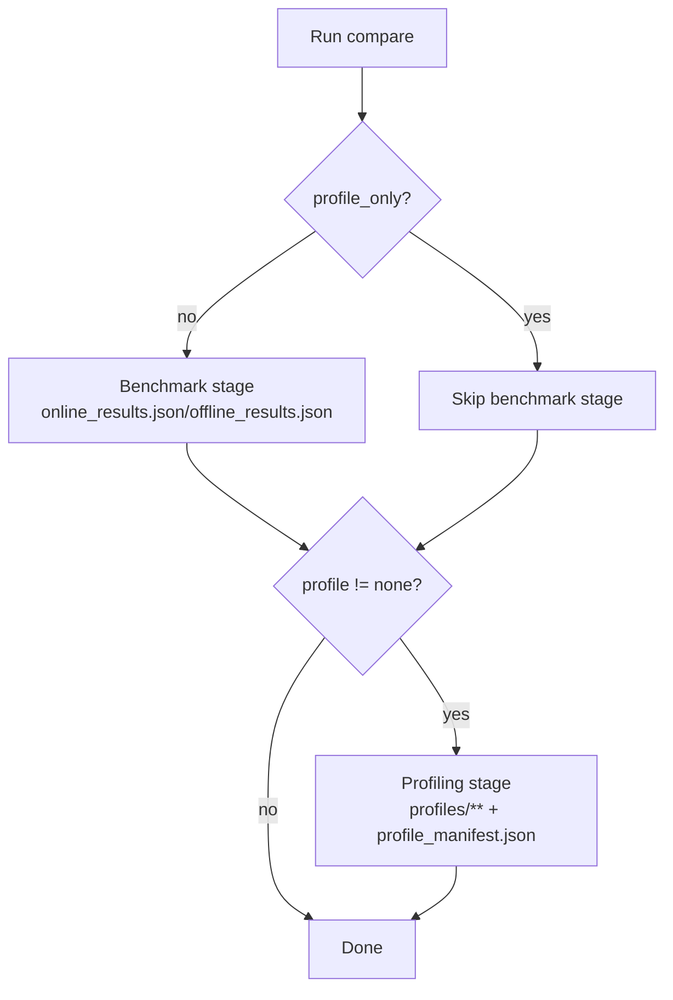

这篇其实是被我自己“逼”出来的。

前几篇我们一直在“把数跑快”（multiprocess、overlap scheduler、各种 kernel/融合），跑 benchmark 图的时候很爽；但只靠 `TTFT/TPOT/ITL/E2E` 和吞吐对比，有一个问题会越来越明显：

> **我知道它变快了，但我不知道它为什么变快 / 还能从哪里再抠。**

所以这篇的目标很明确：**把 benchmark 升级成“benchmark + profiling”的完整闭环**。

更具体地说，我们要做三件事：

1. 在 `online_compare.py / offline_compare.py` 里增加一个 **独立的 profiling stage**（PyTorch profiler + Nsight Systems 两套），并提供 `--profile` / `--profile-only` 开关。
2. profiling stage **只跑最必要的 workload**，并且 **不把 profiler 开销掺进用于画图/表格的 benchmark 数据**（这是关键）。
3. 把 **TensorRT-LLM** 也加到同一套 compare 里（online/offline 都能对齐），让结果里同时看到：baseline / 改进点 / vLLM / SGLang / TRT-LLM。

顺便先说一个“教训”（真的踩过）：我一开始想偷懒，把 torch profiler 直接包在 benchmark 里跑，结果 `p90/p99` 直接变形，吞吐也掉一截——数据变得不干净，回归意义基本为 0。最后还是老老实实把 profiling 拆成一个**额外 stage**，bench 负责“给数”，profile 负责“解释数”。

---

## 业界调研：vLLM / SGLang / TensorRT-LLM 是怎么“科学地采 profile”的？

结论先说：三家都在做同一件事——**只采“特定迭代区间”，并且把 start/stop 变成可控的外部开关**。

### 1) vLLM：用 env 开 profiler，再用 `/start_profile` `/stop_profile` 控制范围

vLLM 的 OpenAI server 里，profiling router 只有在对应 env 打开时才会挂载（源码：[`vllm/entrypoints/serve/profile/api_router.py`](https://github.com/vllm-project/vllm/blob/7b5575fa7dcf76ac86ab8d18501b9cc04f74f6bb/vllm/entrypoints/serve/profile/api_router.py)）：

- Torch profiler：`VLLM_TORCH_PROFILER_DIR=<dir>`
- CUDA profiler（给 nsys capture-range 用）：`VLLM_TORCH_CUDA_PROFILE=1`
- 控制接口：`POST /start_profile`, `POST /stop_profile`

它的思路很清晰：**benchmark 不开 profiler；要采的时候另起一次 server，打开 env，再用 endpoint 把采样窗口卡住**。

### 2) SGLang：profiling 是 server 原生能力，`/start_profile` 还能选 activities

SGLang 的 `/start_profile` 接口更“强”：可以传 JSON 指定 output_dir、start_step、num_steps，以及 activities（源码：[`python/sglang/srt/entrypoints/http_server.py`](https://github.com/sgl-project/sglang/blob/ea177372bd8cb12fca335291e81ef049b8655472/python/sglang/srt/entrypoints/http_server.py)）。

其中最关键的是：

- `activities=["CPU","GPU"]`：走 PyTorch profiler
- `activities=["CUDA_PROFILER"]`：在 server 内部调用 `cudaProfilerStart/Stop`（给 nsys capture-range 用）

所以 SGLang 的做法更接近“profiling 是一等公民”。

### 3) TensorRT-LLM：用 `TLLM_PROFILE_START_STOP=A-B` 精确采指定迭代

TRT-LLM 在官方 perf 分析文档里把这套方案讲得最完整（文档：[`docs/source/developer-guide/perf-analysis.md`](https://github.com/NVIDIA/TensorRT-LLM/blob/7c82605327baf4ee12e8fd2cdd66fd3b87273928/docs/source/developer-guide/perf-analysis.md)）：

- `TLLM_PROFILE_START_STOP=A-B`：指定采样迭代区间
- nsys：`-c cudaProfilerApi` 只捕获 `cudaProfilerStart/Stop` 之间
- torch trace：`TLLM_TORCH_PROFILE_TRACE=<path>`，并且也按 `A-B` 只采指定区间

它的核心价值是：**profile 文件不会爆炸**，并且你能精确对齐 “第几次迭代到底在干嘛”。

---

## 设计：我们要的 profiling harness 长什么样？

我最后定的约束是：

1. **benchmark 和 profiling 分离**：profile 必须是一个额外 stage，不能让 profile overhead 污染 benchmark 指标。
2. **profile-only 必须支持**：只采 profile，不跑完整 benchmark（否则太慢、trace 太大）。
3. **同一套入口同时覆盖 online/offline**：并且对 vLLM / SGLang / roseinfer / TRT-LLM 尽量统一行为。

用一张图表达就是：



### 为什么“分离 stage”很重要？

因为 profiler 开销会改变真实的延迟/吞吐（甚至会改变 batch/schedule 行为）。如果把 profile run 的数据混进 benchmark，你最终会得到一套“不可复现”的对比：

$$
\text{metric}_{\text{bench}} \ne \text{metric}_{\text{bench+profiler}}
$$

所以我的实现原则是：**用于画图/表格的 `*_results.json` 永远只来自 benchmark stage**；profiling stage 的输出全部落到 `profiles/` 目录，并用 `profile_manifest.json` 单独索引。

---

## 代码变更（哪些文件动了）

这篇改动点看起来多，但本质上就两类：**bench harness** 和 **roseinfer 的 profile 控制面**。

- `benchmarks/serving/online_compare.py`：新增 profiling stage、`--profile`/`--profile-only`，并加上 `trtllm` server 启动与对齐逻辑。
- `benchmarks/serving/offline_compare.py`：新增 profiling stage、`--profile-only`，并加上 `trtllm` offline 路径（token-id 输入对齐）。
- `benchmarks/serving/plot_compare.py`：补齐 `trtllm` 的 label/color/marker，online 图里用空心 marker 表示 `p99`。
- `rosellm/roseinfer/server.py`：新增 `/start_profile` `/stop_profile`，并保证 in-proc 模式下 start/stop 在 worker thread 里执行。
- `rosellm/roseinfer/mp.py`：engine-process 模式下新增 `StartProfileCmd/StopProfileCmd` + ack event，让 profiler 真正开在 engine 进程。
- `rosellm/roseinfer/engine.py`：加 `record_function` + 可选 NVTX（`ROSEINFER_NVTX=1`）标记，方便读 timeline。

---

## 实现：benchmarks/serving 里加 profiling stage

### 1) Online：`online_compare.py --profile torch|nsys|both`

新增参数（核心）：

- `--profile none|torch|nsys|both`
- `--profile-only`
- `--profile-n` / `--profile-scale` / `--profile-output-len`

输出布局：

- benchmark：`online_<ts>/online_results.json`
- profiling：`online_<ts>/profiles/<tool>/<backend>/...`
- 索引：`online_<ts>/profile_manifest.json`

nsys 这边我统一用：

- `--capture-range=cudaProfilerApi`
- `--trace=cuda,nvtx,osrt`
- `--cuda-graph-trace=node`
- `--trace-fork-before-exec=true`

并把 “start/stop capture” 放到每个 backend 自己的机制里：

- vLLM：env + `/start_profile` `/stop_profile`
- SGLang：`activities=["CUDA_PROFILER"]`
- roseinfer：新增 `/start_profile` `/stop_profile`（见后文）
- TRT-LLM：`TLLM_PROFILE_START_STOP=1-20`

### 2) Offline：`offline_compare.py --profile torch|nsys|both`

offline 的 profiling stage 和 online 一样：**单独跑**、**单独落盘**，并且支持 `--profile-only`。

区别是：offline 没有 server，所以：

- torch profiler：直接在每个 backend 的 `generate(...)` 调用外面包一层 `torch.profiler.profile(...)`，导出 `trace.json`
- nsys：用 `nsys profile -c cudaProfilerApi` 包住 subprocess，同时在进程里调用 `torch.cuda.profiler.start/stop`

同样会写：

- `offline_<ts>/profiles/<tool>/<backend>/...`
- `offline_<ts>/profile_manifest.json`

---

## roseinfer：踩坑最多的地方（也是最关键的）

### 坑 0：TRT-LLM “看起来能用”，但 import 可能直接炸

如果你是 “直接用源码路径 + PYTHONPATH” 的方式引 TRT-LLM（而不是 pip/NGC 环境一键装齐），会遇到一个很尴尬的情况：`find_spec("tensorrt_llm")` 能找到，不代表你真能 `import tensorrt_llm`。

我在这台环境里第一次试就遇到：

```text
ModuleNotFoundError: No module named 'nvtx'
```

所以 `trtllm` backend 的“可用性检查”，必须做成**真正 import 一次**（脚本里用子进程跑 `python -c "import tensorrt_llm"`），失败就直接 skip 并 warn，避免跑到一半才爆。

### 坑 1：默认是 engine-process 模式，profile 必须落在 engine 进程

现在 roseinfer 默认是 `--engine-process`：FastAPI 进程里只有 tokenize/detok + dispatch，真正的 GPU forward 在 engine 子进程里。

如果你把 profiler 开在 FastAPI 进程：

- torch profiler 基本采不到 GPU kernel（因为 kernel 根本不在这个进程里）
- nsys capture-range 也对不上（cudaProfilerStart/Stop 要在跑 CUDA 的进程里执行）

所以我做了两件事：

1. 在 `rosellm/roseinfer/mp.py` 里新增 `StartProfileCmd/StopProfileCmd`，通过 queue 把 profiling 命令发给 engine 进程执行。
2. 用 `ProfileEvent` 做 ack，保证 `/start_profile` 返回时 profiling 已经生效，避免 race。

### 坑 2：in-proc 模式里 GPU compute 在 worker thread，start/stop 也必须在那个 thread 执行

如果你 `--no-engine-process`，scheduler loop 在 `SchedulerManager._worker_loop()` 的 worker thread 里跑。torch profiler 的 CPU event 和 cudaProfilerStart/Stop 都最好在同一个执行线程里做。

所以我在 `rosellm/roseinfer/server.py` 里做了一个“小型 mailbox”：

- API thread 写入 `_profile_pending` + `Event`
- worker thread 每轮 loop 优先处理 pending，执行 start/stop，然后 set ack

### 坑 3：stop 的语义要稳：stop 两次也不能炸

为了让 benchmark harness 写起来简单（对齐 vLLM/SGLang 的 `/stop_profile` 无 body 设计），roseinfer 的 `/stop_profile` 做成：

- 依次尝试 stop torch 和 stop cuda
- 只要有一个 stop 成功就返回 200

这样 online profiling stage 可以固定写法：先 start 再 stop，不用在 client 侧维护“当前 active tool 是谁”。

### 坑 4：vLLM 的 `/start_profile` 不是“默认就有”

vLLM 的 profiling router 是按 env 挂载的：你不开 `VLLM_TORCH_PROFILER_DIR` 或 `VLLM_TORCH_CUDA_PROFILE`，就算你去 POST `/start_profile` 也只会拿到 404。

所以 online profiling stage 我做成两步：

1. 先按工具类型设置 env（torch / nsys）
2. 再启 server，然后 POST `/start_profile` / `/stop_profile`

这样能保证“行为一致”，也省掉一堆不必要的判断分支。

---

## 额外加料：NVTX / record_function 标记（方便看 timeline）

profiling 的可读性很大程度取决于“有没有可读的标记”：

- PyTorch profiler 看 `record_function` 区间
- nsys 看 NVTX range

所以我做了一个很实用的小增强：

- `rosellm/roseinfer/engine.py` 的 overlap scheduler 中，给 “schedule batch / process pending” 两段加了：
  - `record_function("roseinfer.scheduler.overlap.*")`
  - `torch.cuda.nvtx.range_push/pop`（通过 `ROSEINFER_NVTX=1` 开关）

这会让你在 timeline 里很容易定位：

- GPU forward 在哪
- async copy / synchronize 在哪
- CPU post-process 在哪

---

## 用法（推荐）

### 产物目录结构（跑完你会看到什么）

online 的一次 run 会长这样（offline 类似）：

```text
outputs/benchmarks/serving/online_<ts>/
  online_results.json
  profile_manifest.json
  profiles/
    torch/
      roseinfer/...
      vllm/...
      sglang/...
      trtllm/...
    nsys/
      ...
```

### Online：benchmark + profile（推荐流程）

```bash
python benchmarks/serving/online_compare.py \
  --model gpt2 --gpu 0 \
  --backends roseinfer,vllm,sglang,trtllm \
  --roseinfer-compare-overlap-schedule \
  --n 200 --scales 0.4,0.8,1.6 \
  --max-output-len 64 \
  --ignore-eos

# 单独采 profile（不污染 benchmark 指标）
python benchmarks/serving/online_compare.py \
  --model gpt2 --gpu 0 \
  --backends roseinfer,vllm,sglang,trtllm \
  --profile both --profile-only \
  --profile-n 32 --profile-output-len 32
```

### Offline：benchmark + profile

```bash
python benchmarks/serving/offline_compare.py \
  --model gpt2 --gpu 0 \
  --backends roseinfer,vllm,sglang,trtllm \
  --roseinfer-compare-overlap-schedule \
  --num-prompts 128 --input-len 256 --output-len 64 \
  --ignore-eos

python benchmarks/serving/offline_compare.py \
  --model gpt2 --gpu 0 \
  --backends roseinfer,vllm,sglang,trtllm \
  --profile both --profile-only \
  --profile-num-prompts 8 --profile-input-len 256 --profile-output-len 32
```

profiling 产物会在对应 run 目录下：

- `profiles/<tool>/<backend>/...`
- `profile_manifest.json`

---

## Benchmark 结果：如何保持“公平”和“可解释”

公平比较我坚持两点：

1. **online**：同一份 TraceA、同一套 sampling 参数、同一个 OpenAI client，逐个启动不同 server 回放。
2. **offline**：统一走 token-id 输入（`prompt_token_ids`），并尽量关闭 detokenize（`detokenize=False` / `skip_tokenizer_init=True`）。

profiling 则只做一件事：**解释 benchmark**，而不是“再跑一次新的 benchmark”。

> 注：本仓库的 compare 已经支持把 TRT-LLM 纳入同一套结果；如果当前环境未安装 TRT-LLM，则会跳过该 backend（脚本会 warn）。

---

## 小结

这一轮的提升点不在于“又快了多少”，而在于：我们终于有了一套 **跨框架可对照的 profiling 工具链**：

- benchmark 负责给出可回归的“数”
- profiling 负责解释“为什么”

后续再做任何优化（kernel / scheduler / memory / 多进程），都能直接：

1. A/B 跑 benchmark
2. profile-only 抓一份 torch trace + nsys trace
3. 对照 vLLM/SGLang/TRT-LLM 的 timeline 查差异

下一篇准备拿这套 profiling harness，去把 overlap scheduler 的“pipeline 形态”在 timeline 上完整画出来（以及看它和 SGLang 的差距到底在哪里）。
