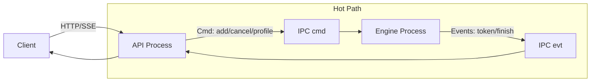

在 [071](./2025-12-26-llm-inference-from-scratch-071-multiprocess-serving-roseinfer) 里我把 roseinfer 从单进程拆成了 **API process + engine process**。tail 确实稳了，但拆完以后很快就会碰到一个现实问题：

> 多进程不是“画张架构图就结束”，它会带来一堆很真实的工程税。  
> 线程池、绑核、IPC、loop 公平性、streaming 形态，任何一个点没抠对，性能就会漏气。

这篇我就干一件事：把这堆工程税压到我愿意长期背着的水平——默认配置就是最强；每个点都有开关；能做论文式 ablation；并且能用 profile 把结论讲清楚。

---

## 目标

我对 multiprocess serving 的要求其实非常苛刻：

1) **性能**：MP baseline（全开）在 roseinfer variants 里应该是最优；至少不能出现“关掉某个优化反而更快”的反直觉。  
2) **稳定**：benchmark 能跑不算数，profile stage 偶发 crash 才是线上真正会炸的那种。  
3) **可解释**：每个优化点都有 option，ablation 像论文一样能复现；profile 文件位置固定、读法清晰。  

对标对象我就盯三个：vLLM / SGLang / TensorRT-LLM。

---

## 业界复盘：他们为什么 multi-process 还能这么快？

我这次刻意把视角从“attention 算子”挪到“系统工程税”，因为 multiprocess 真正拖性能的往往就是这些。

### 1) 线程池：多进程 + 默认线程数 = 直接 CPU 过载

vLLM 在 multiprocess executor 里直接把 `OMP_NUM_THREADS` 这类东西压住，注释写得很直白：多进程默认线程数会造成 CPU contention（源码：[`vllm/v1/executor/multiproc_executor.py`](https://github.com/vllm-project/vllm/blob/7b5575fa7dcf76ac86ab8d18501b9cc04f74f6bb/vllm/v1/executor/multiproc_executor.py) 的 `set_multiprocessing_worker_envs`）。

SGLang 的 GPU worker 也会在加载权重前 `torch.set_num_threads(1)`，理由同样是 “reduce thread conflicts”（源码：[`python/sglang/srt/model_executor/model_runner.py`](https://github.com/sgl-project/sglang/blob/ea177372bd8cb12fca335291e81ef049b8655472/python/sglang/srt/model_executor/model_runner.py)）。

结论：**多进程场景下，默认线程数几乎总是负收益**。

### 2) 输入预算：别把 scheduler loop 的 decode 给饿死

SGLang 的 scheduler 收请求时有 `max_recv_per_poll` 上限，达到就 break（源码：[`python/sglang/srt/managers/scheduler.py`](https://github.com/sgl-project/sglang/blob/ea177372bd8cb12fca335291e81ef049b8655472/python/sglang/srt/managers/scheduler.py)）。直觉很简单：极端负载下输入洪峰会吞掉一整轮 loop 时间，decode 被饿死，tail 直接爆炸。

结论：**scheduler loop 必须给 decode 留预算**。

### 3) 绑核：别“数学正确但拓扑错误”

这点 vLLM/SGLang 没把策略写死给你看，但它们都给了暗示：CPU 要当资源规划，而不是交给 OS 随缘。SGLang 甚至会给 GPU 进程设置 affinity（源码：[`python/sglang/srt/utils/common.py`](https://github.com/sgl-project/sglang/blob/ea177372bd8cb12fca335291e81ef049b8655472/python/sglang/srt/utils/common.py)）。

我自己的坑是：混合架构（P-core/E-core）上，“把可用 CPU list 一分为二”很容易把 engine pin 到慢核，做成纯负优化（下面会详细讲）。

### 4) Streaming：默认就是 async

这个坑特别“线上”：Starlette/FastAPI 的 `StreamingResponse` 如果给 sync generator，会把 generator 丢线程池跑，本质就是 **一个 stream 一条线程**。vLLM/SGLang 的 OpenAI server 默认姿势都是 async streaming——它们不一定显式告诉你“别这么干”，但默认实现已经把坑绕开了。

---

## 我们的 root cause：为什么 071 的 multiprocess 还不够“极致”？

把 multiprocess 相比 in-proc 多出来的成本拆开看，基本就五类：

1) **CPU 竞争**：API+engine 都跑 PyTorch/tokenizer/detok，默认线程池把 CPU 打爆；  
2) **IPC 工程税**：token 事件在热路径上分配 dict/list，再 pickle/queue；  
3) **loop 不公平**：输入 drain 太狠会饿死 decode；  
4) **绑核翻车**：auto split 把 engine pin 到慢核 / 拆开 SMT siblings；  
5) **服务边界瓶颈**：StreamingResponse 的线程海把 tail 拖坏（甚至饿 GPU）。  

另外还有一个“必须补作业”的点：**profile stage 偶发 crash**。这类 crash 线上一定会以更恶心的方式炸出来，不把它收敛掉，我不相信任何性能结论。

---

## 设计总览：API/Engine 两进程 + 热路径减肥

整体拓扑还是 071 的边界（API process + engine process），但这次把热路径上每一坨“杂物”都抠了一遍：



原则很简单：**engine loop 里不做没必要的 Python 分配；API 侧不搞线程海；CPU 资源要规划；profile 要能复现。**

---

## 一组默认按“正收益”打开的 MP 优化

这里我统一用论文式标记：

- `-xxx`：默认打开的正收益特性，ablation 是关掉它；  
- `+yyy`：默认关闭的风险/负收益项，ablation 是打开它。  

### 1) `-thr cap`：每个进程的 PyTorch/OMP 线程池都 cap 到 1，默认开

做法就是 vLLM/SGLang 那套：engine/API 两边都把 `torch.set_num_threads(1)` / `torch.set_num_interop_threads(1)`，并配套 `OMP_NUM_THREADS=1` / `MKL_NUM_THREADS=1`。

目标不是“让单次更快”，而是 **避免多进程 CPU 竞争把 tail 拖烂**。

### 2) `-affinity`：topology-aware 自动绑核，默认开

我一开始的 auto split 是典型“数学正确”：把 `sched_getaffinity()` 的 CPU list 平分。  
问题是：混合架构（以 i9-13900K 这种为代表）上，CPU id 和核快慢很可能相关；你把 engine 分到尾巴，很可能就是 E-core。

所以我现在的策略是按 physical core 分，而不是按 cpu id 分：

1) 读取 `/sys/devices/system/cpu/cpu*/topology/thread_siblings_list` 做 core 分组；  
2) 优先把 **SMT group（通常是 P-core）** 分给 engine；  
3) 不把同一个 physical core 的 SMT siblings 拆给两个进程；  
4) 小 CPU 份额（容器只给 0-15 这类）时保证 engine 至少拿一半，否则 engine loop 会被饿死。  

```mermaid
graph TB
  subgraph "CPU affinity set"
    P[SMT groups (often P-cores)<br/>(0,1) (2,3) ...]
    E[solo groups (often E-cores)<br/>(16) (17) ...]
  end
  P -->|prefer| ENG[engine process]
  E -->|spill| API[API process]
  ENG -->|leave enough budget| API
```

实现落在 `rosellm/roseinfer/server.py`（`_cpu_core_groups()` / `_auto_split_cpu_affinity()`）。

### 3) `-cmd budg`：输入处理预算，默认 `mp_max_recv_per_iter=64`

对应 SGLang 的 `max_recv_per_poll`：每轮最多收 N 个 cmd，剩下留给下一轮，保证 decode 不会被输入洪峰饿死。

### 4) `pipe bytes` + `-flat evts`：事件拍平 + 走 `send_bytes/recv_bytes`，默认开

目标是把 token 事件从“Python 对象海”变成“可 memcpy 的扁平数据”：

- 旧：`dict[int, list[int]]` / `list[finished]`（大量对象）  
- 新：`array('I')` 形式的 `(rid, token_id)` pairs + `finished_ids`  
- IPC 默认用 `multiprocessing.Connection.send_bytes/recv_bytes`，避免 `multiprocessing.Queue` 的 pickle/feeder thread 开销。  

`+queue ipc` 作为对照项保留（默认关）。

### 5) `-batch send` / `-fill tgt`：减少 IPC 调用次数、避免碎 batch，默认开

这两个点都是纯工程：让 API->engine 的 cmd 发送更“块状”，让 engine 侧每轮更接近填满（而不是被碎片化请求打成小 batch）。

### 6) Offline 特有：`-fast cnt` 默认开，`+stream tok` 默认关

offline throughput 默认是 finish-only：不需要 streaming token，只要最终 output token 数。

如果你还每 step 更新 token_count dict，本质是在用“在线粒度”做“离线统计”，纯浪费 CPU。  
所以 `-fast cnt` 的快路径是：request finished 时一次性取 `scheduler.get_step_count(rid)` 写最终统计。

`+stream tok` 则是故意把离线也打开 token event（作为对照，默认关）。

#### 为什么 `-fast cnt` 一关就暴跌？

这个点我一开始也没想到会这么“夸张”，后来把代码摊开看就很清楚了：它不是那种“微调一下，+1%”的优化，而是把一坨完全没必要的 Python 热路径删掉了。

我们 offline 的 MP 路径默认是 `finish-only`（`mp_finish_only=True`）：engine 不往外发 token stream，只在请求结束时回一个 “这个请求一共生成了多少 token”。然后 benchmark 脚本用这个 count 去算 `tok/s`。

问题在于：**你怎么得到这个 count**？

- 朴素做法（`+slow cnt`，也就是把 `-fast cnt` 关掉）：
  - engine 进程自己维护一个 `token_counts: dict[rid, cnt]`；
  - 每一次 decode step 都会拿到 `step_tokens: dict[rid, token_id]`；
  - 然后在 Python 里对每个 `rid` 做一次 `token_counts[rid] += 1`；
  - 请求 finished 时，把 `token_counts[rid]` 发回去。

伪代码大概就是这样：

```python
for step in range(T):
    step_tokens = scheduler.step()  # dict[rid -> token]
    for rid in step_tokens:
        token_counts[rid] += 1       # Python dict get/set 热路径
```

这在 “小模型 + 高吞吐” 的 offline 场景里非常致命：gpt2 在 4070 上 decode 得太快了，你很容易把瓶颈从 GPU 直接挪到 CPU。于是你会看到一个非常真实的现象：

> GPU 其实能跑得更快，但你在 CPU 上为了“统计一个数”付出了 20%+ 的时间。

而 `-fast cnt` 的核心思想就是一句话：**别重复记账**。

scheduler 作为生成逻辑的一部分，本来就必须维护 “一个请求已经生成了多少步/多少 token”：

- 要判断 `max_new_tokens` 什么时候到；
- 要做 `stop_on_eos`；
- 要处理 prefix cache / overlap schedule 的一些边界。

所以我直接复用这个内部计数：请求 finished 时调用 `scheduler.get_step_count(rid)`，把它作为最终 token 数回传；整个过程中不再维护 `token_counts` dict，自然也就没有 “每 token 一次 dict get/set” 这种纯 CPU 税。

你看我们这轮 offline 数据里，`-fast cnt` 一关吞吐从 `12873 tok/s` 掉到 `9456 tok/s`，本质上就是这段 Python bookkeeping 在吞时间。

#### 那 vLLM / SGLang / TensorRT-LLM 为啥不需要这招？

因为它们在 offline benchmark 里压根不会走这种 “每 token 用 Python 维护一个计数器” 的路径。

更常见（也更合理）的做法是：**生成结束后再统计**，或者直接用 engine 内部已经维护好的长度字段：

- vLLM：`llm.generate(..., detokenize=False)` 返回 `RequestOutput`，最后 `len(out.outputs[0].token_ids)` 统计一次就行（见 `benchmarks/serving/offline_compare.py::_run_vllm`）。
- SGLang：`engine.generate(...)` 返回的每个结果里有 `meta_info[\"completion_tokens\"]`，直接求和（见 `benchmarks/serving/offline_compare.py::_run_sglang`）。
- TensorRT-LLM：返回结构里也能拿到 `token_ids`，最后 `len(...)` 求和即可；并且核心执行在 C++/TensorRT 里，长度字段本来就得有（见 `benchmarks/serving/offline_compare.py::_run_trtllm`）。

换句话说：`-fast cnt` 不是什么“作弊 trick”，它只是把 roseinfer MP finish-only 这条链路补齐到和它们同一个思路：**不要为了 benchmark 指标，在热路径上额外做一遍计数。**

（更进一步说：在我们这轮 offline 是 `--ignore-eos`，理论上甚至可以直接用 `num_prompts * output_len` 得到总 token 数。但我还是保留了 “从 engine 拿实际 count” 的路径：一是为了支持 `ignore_eos=False` 的情况，二是避免未来改动时出现“看起来 token 固定但实际不固定”的坑。）

---

## 稳定性：把 profile-only 偶发 `device-side assert` 收敛掉

这个坑我很想写下来，因为它太典型：

- benchmark 200/200 全绿；  
- profile-only 偶发 crash；  
- 报错在某个 `synchronize()`，堆栈非常误导；  
- signature 是 `indexSelectSmallIndex ... Assertion srcIndex < ... failed`。  

这种东西如果不收掉，你线上迟早要用更恶心的方式还债。

我最后做了三层“几乎不增加热路径成本”的防线（都在 `rosellm/roseinfer/engine.py`）：

1) fused sampler 输出 clamp：永远落在 $[0, vocab-1]$；  
2) overlap future map resolve：index 做 bounds clamp（避免 placeholder 映射越界）；  
3) future token map 从 `empty` 改成 `zeros`：避免未定义读变成随机大数直接把 embedding 炸穿。  

这三层叠起来以后，profile stage 就能稳定全绿，后面再谈“极致性能”才踏实。

---

## Async Streaming：把 “thread per stream” 的线程海拔掉，只改边界层

这里我先讲清楚现象，不然你会误判成 GPU 问题：

> Starlette/FastAPI 的 `StreamingResponse` 如果你给的是 sync generator，它会把 generator 放线程池跑。  
> 请求一多就是线程海 + context switch + GIL 抖动，最后表现为 tail 变丑、host launch gap 变大、GPU 被 CPU 饿住。

我不想为了 async 把整个 engine/scheduler 改成 asyncio（复杂度太高），所以目标很明确：

- engine/IPC 继续走线程/进程（热路径不动）；  
- 只把 “API -> client 的 token streaming” 改成 async generator；  
- 不引入额外线程，不把 engine 卡在 asyncio 上。  

最终就是一个小到离谱的桥接队列：`HybridQueue`（`rosellm/roseinfer/hybrid_queue.py`）。

```mermaid
sequenceDiagram
  participant ENG as Engine thread/process
  participant Q as HybridQueue
  participant LOOP as asyncio loop (API process)
  participant SSE as async generator (StreamingResponse)

  ENG->>Q: put(piece)
  Q-->>LOOP: call_soon_threadsafe(event.set)
  SSE->>Q: await aget()
  Q-->>SSE: piece / None (EOS)
  SSE-->>LOOP: yield chunk
```

开关：

- `--async-streaming`（默认开）  
- `--no-async-streaming`（ablation：`-async stream`）  

顺便把一个常用关系式写在这儿（读图很方便）：

$$
E2E \approx TTFT + (n_{out}-1)\cdot TPOT
$$

streaming 链路上的 CPU 抖动会被放大到 $TPOT$ 的尾部，这也是为什么这个优化对 online tail 特别敏感。

---

## Benchmark 方法：online 的 “trace” 是啥？跑一次大概多久？

先把术语说清楚，不然很容易鸡同鸭讲。

### Offline：吞吐 - finish-only

offline 这边就是最传统的吞吐测试：

- `num_prompts=128`  
- `input_len=256`  
- `output_len=64`（并且 `--ignore-eos`，强制每个请求都跑满 64 token，避免 EOS 提前结束造成 token 数不一致）  
- `max_batch_size=256`  
- `warmup_prompts=8` + `warmup_full_batch=True`（非常关键，后面会解释为什么）  

这一轮完整跑完（含 vLLM/SGLang/TRT-LLM + ablation）总 wall time 大概 3 分钟：`outputs/benchmarks/serving/offline_20251229_001108/offline_results.json` 的 `meta.wall_s=178.9` 秒。

### Online：trace-driven latency - TTFT/TPOT/ITL/E2E

online 不是自己造 uniform QPS，而是用一个带时间戳的请求序列（trace）去压：

- trace 文件：`~/.cache/rosellm/benchmarks/traceA.jsonl`  
- `--n 200`：取 trace 里的前 200 个请求  
- `scale`（图里横坐标的 Trace time scale）：把 trace 的 inter-arrival time 乘上一个系数  
  - scale 越小 => 请求到达越密 => 负载越高  

在线这轮总 wall time 大概 45 分钟：`outputs/benchmarks/serving/online_20251228_231859/online_results.json` 的 `meta.wall_s=2699.3` 秒。

### Profile：单独 stage，不污染 benchmark 数据

两套脚本都支持：

- `--profile torch|nsys|both`：额外跑 profile stage；  
- `--profile-only`：只采 profile，不跑完整 benchmark；  
- profile 的请求数/长度单独设（避免 trace 巨大）。  

---

## 结果：以最新、最可信的一组数据为准

下面的图/表我统一用这两次跑出来的产物（同一个 git_rev）：

- online：`outputs/benchmarks/serving/online_20251228_231859/online_results.json`  
- offline：`outputs/benchmarks/serving/offline_20251229_001108/offline_results.json`  

### Online：延迟

p90 曲线 + p50–p90 band，空心点为 p99。


为了更直观看 tail（以及避免 band 把图挤得太花），我另外画了两张“只看一个分位”的版本：

#### Online：只看 P99


#### Online：只看 P90


#### Online：单点对比图，固定 5 个 baseline + 1 个变体

每张图里固定放：`roseinfer` / `roseinfer (in-proc)` / `vLLM` / `SGLang` / `TensorRT-LLM`，然后额外加一个“单点变体”，让 P90/P99 的差异更容易被肉眼抓出来。

**对比：-async stream**


**对比：-flat evts**


**对比：-cmd budg**


**对比：-fill tgt**


**对比：-affinity**


**对比：-thr cap**


**对比：+queue ipc**


#### 原始数据表格

| scale | backend | TTFT p50/p90/p99 (ms) | TPOT p50/p90/p99 (ms) | ITL p50/p90/p99 (ms) | E2E p50/p90/p99 (ms) |
|---:|---|---:|---:|---:|---:|
| 0.40 | roseinfer | 8.89/15.44/82.62 | 1.19/1.43/6.89 | 1.13/1.42/2.65 | 155.08/187.03/814.29 |
| 0.40 | roseinfer (in-proc) | 8.85/15.43/76.99 | 1.20/1.45/7.23 | 1.14/1.46/2.90 | 155.74/188.87/856.59 |
| 0.40 | roseinfer (-affinity) | 9.27/15.54/75.57 | 1.19/1.45/6.33 | 1.14/1.44/2.63 | 154.91/188.75/744.20 |
| 0.40 | roseinfer (-async stream) | 9.74/16.07/88.98 | 1.35/1.51/7.13 | 1.28/1.56/3.13 | 174.47/195.80/840.56 |
| 0.40 | roseinfer (-cmd budg) | 9.63/15.82/85.61 | 1.34/1.51/7.11 | 1.28/1.54/3.46 | 173.61/198.54/835.71 |
| 0.40 | roseinfer (-fill tgt) | 9.20/15.62/87.10 | 1.19/1.44/7.08 | 1.13/1.43/2.75 | 155.83/188.85/837.33 |
| 0.40 | roseinfer (-flat evts) | 9.34/15.86/119.46 | 1.19/1.45/7.68 | 1.14/1.45/2.88 | 156.26/189.74/914.13 |
| 0.40 | roseinfer (-thr cap) | 9.49/16.11/111.37 | 1.35/1.53/5.42 | 1.28/1.53/3.27 | 174.68/199.52/530.98 |
| 0.40 | roseinfer (+queue ipc) | 9.98/16.20/87.04 | 1.35/1.51/7.13 | 1.28/1.54/3.18 | 174.20/197.10/838.82 |
| 0.40 | SGLang | 7.67/9.69/14.58 | 1.10/1.23/1.57 | 1.07/1.29/3.06 | 144.10/157.67/197.26 |
| 0.40 | TensorRT-LLM | 5.68/6.28/7.60 | 1.38/1.41/1.87 | 1.37/1.51/2.59 | 180.05/184.11/190.06 |
| 0.40 | vLLM | 9.21/10.28/13.09 | 1.59/1.84/1.99 | 1.53/1.86/3.30 | 200.58/235.18/255.43 |
| 0.80 | roseinfer | 5.17/5.90/7.53 | 1.12/1.19/1.23 | 1.10/1.26/1.63 | 145.87/154.57/160.55 |
| 0.80 | roseinfer (in-proc) | 4.00/4.62/5.63 | 1.12/1.20/1.33 | 1.10/1.27/2.01 | 145.24/155.24/160.99 |
| 0.80 | roseinfer (-affinity) | 5.04/5.83/6.65 | 1.11/1.19/1.23 | 1.10/1.26/1.62 | 145.30/154.86/160.37 |
| 0.80 | roseinfer (-async stream) | 5.21/6.37/7.01 | 1.27/1.35/1.37 | 1.24/1.44/1.80 | 161.46/175.56/179.46 |
| 0.80 | roseinfer (-cmd budg) | 5.28/6.28/6.78 | 1.27/1.34/1.36 | 1.25/1.42/1.79 | 162.93/175.27/178.53 |
| 0.80 | roseinfer (-fill tgt) | 5.21/5.83/6.52 | 1.11/1.19/1.23 | 1.10/1.26/1.61 | 145.43/155.31/160.07 |
| 0.80 | roseinfer (-flat evts) | 5.32/5.89/6.98 | 1.11/1.20/1.24 | 1.10/1.27/1.65 | 145.77/155.13/161.13 |
| 0.80 | roseinfer (-thr cap) | 5.16/6.17/7.93 | 1.27/1.35/1.39 | 1.24/1.42/1.78 | 160.76/174.47/179.42 |
| 0.80 | roseinfer (+queue ipc) | 5.40/6.33/6.91 | 1.27/1.35/1.37 | 1.24/1.42/1.79 | 162.73/175.13/178.96 |
| 0.80 | SGLang | 8.50/10.28/15.90 | 1.07/1.17/1.39 | 1.06/1.22/2.14 | 143.34/152.21/161.56 |
| 0.80 | TensorRT-LLM | 5.77/6.46/7.66 | 1.37/1.39/1.61 | 1.36/1.48/2.06 | 179.11/182.43/191.21 |
| 0.80 | vLLM | 9.20/10.36/11.11 | 1.45/1.67/1.85 | 1.42/1.69/2.73 | 187.58/213.70/233.04 |
| 1.60 | roseinfer | 5.36/5.99/6.76 | 1.11/1.18/1.27 | 1.09/1.23/1.54 | 143.86/152.06/163.43 |
| 1.60 | roseinfer (in-proc) | 4.18/4.71/5.12 | 1.12/1.19/1.26 | 1.10/1.22/1.93 | 143.92/153.71/162.79 |
| 1.60 | roseinfer (-affinity) | 5.39/5.95/6.86 | 1.11/1.18/1.25 | 1.09/1.23/1.53 | 144.18/153.32/161.17 |
| 1.60 | roseinfer (-async stream) | 5.48/6.16/7.10 | 1.25/1.34/1.44 | 1.23/1.40/1.73 | 161.54/173.63/188.90 |
| 1.60 | roseinfer (-cmd budg) | 5.43/6.29/7.02 | 1.26/1.35/1.43 | 1.23/1.40/1.71 | 161.16/174.38/185.72 |
| 1.60 | roseinfer (-fill tgt) | 5.49/6.07/6.83 | 1.11/1.19/1.25 | 1.09/1.24/1.56 | 144.35/154.65/163.69 |
| 1.60 | roseinfer (-flat evts) | 5.41/6.10/6.74 | 1.11/1.18/1.25 | 1.09/1.23/1.54 | 143.76/152.17/163.99 |
| 1.60 | roseinfer (-thr cap) | 5.41/6.29/6.93 | 1.26/1.34/1.41 | 1.23/1.40/1.70 | 161.23/174.45/183.97 |
| 1.60 | roseinfer (+queue ipc) | 5.80/6.48/7.48 | 1.26/1.35/1.42 | 1.23/1.40/1.72 | 161.60/174.33/185.84 |
| 1.60 | SGLang | 9.12/10.73/15.47 | 1.06/1.16/1.32 | 1.06/1.20/1.87 | 143.18/151.19/175.24 |
| 1.60 | TensorRT-LLM | 5.95/6.51/7.43 | 1.37/1.39/1.52 | 1.36/1.48/1.88 | 179.02/182.16/192.10 |
| 1.60 | vLLM | 9.55/10.81/11.40 | 1.37/1.57/1.74 | 1.37/1.60/2.05 | 182.75/202.63/227.41 |

我自己的读法很直接：

- `-async stream` 在 scale=0.8/1.6 上把 E2E/TPOT 拉得很明显（线程海的代价）；  
- `+queue ipc`、`-flat evts` 这类改动对 p99 很诚实：热路径的 Python/IPC 开销就是会放大到尾部；  
- baseline（全开）在 roseinfer variants 里终于变得像 baseline：**它应该最稳、也确实最稳**。  

### Offline：吞吐 - finish-only


#### 原始数据表格

| backend | req/s | output tok/s | total tok/s | total latency (s) |
|---|---:|---:|---:|---:|
| roseinfer | 201.14 | 12872.99 | 64364.95 | 0.636 |
| roseinfer (in-proc) | 204.01 | 13056.84 | 65284.22 | 0.627 |
| roseinfer (+kv256) | 0.00 | 0.00 | 0.00 | 9.071 |
| roseinfer (-affinity) | 201.03 | 12866.10 | 64330.52 | 0.637 |
| roseinfer (-batch send) | 200.21 | 12813.58 | 64067.92 | 0.639 |
| roseinfer (-cmd budg) | 201.06 | 12867.85 | 64339.24 | 0.637 |
| roseinfer (-fill tgt) | 200.99 | 12863.17 | 64315.84 | 0.637 |
| roseinfer (-thr cap) | 201.16 | 12874.52 | 64372.58 | 0.636 |
| roseinfer (+queue ipc) | 200.26 | 12816.90 | 64084.48 | 0.639 |
| roseinfer (-fast cnt) | 147.75 | 9456.12 | 47280.59 | 0.866 |
| roseinfer (+stream tok) | 201.26 | 12880.77 | 64403.85 | 0.636 |
| SGLang | 243.20 | 15564.48 | 77822.40 | 0.526 |
| TensorRT-LLM | 248.69 | 15916.24 | 79581.21 | 0.515 |
| vLLM | 140.44 | 8988.14 | 44940.70 | 0.911 |

offline 这张我更关心两点：

1) MP baseline 已经非常接近 in-proc（差距大概就是“多进程固定税”的那点尾巴，约 1–2%）；  
2) `-fast cnt` 一关就暴跌，说明我们之前确实在用“在线粒度”做“离线统计”，纯浪费 CPU。  

（`+kv256` 这次直接 OOM：它属于风险项，默认就应该关，ablation 里留着只是提醒自己“别手痒”。）

---

## 一个很蠢但很关键的坑：为什么你会看到 vLLM 对比“前后翻转”？

这段我必须写，不然我自己也不信我跑出来的数。

我早期有一轮 offline（同一个 git_rev=5099b2b）跑出来 `roseinfer < vLLM`，后来又变成 `roseinfer > vLLM`。看起来像“优化点差不多但结论乱跳”，实际根因是：**我把一次性开销算进了计时**。

具体表现是：

- 旧的 offline 跑数没有 `warmup_full_batch`（warmup 没覆盖到真正的 shape/path）；  
- CUDA Graph capture / Triton compile / allocator warmup 这些一次性成本被计进了 timed region；  
- vLLM 这类系统本身 init/warmup 覆盖更完整，所以受影响更小；  
- 结果就是：只有 roseinfer 看起来突然慢了 2×，排名被污染。  

我现在统一用带 `warmup_full_batch=True` 的那轮作为最终 offline 数据（就是上面那张表），这才是 steady-state 吞吐。

---

## Profiling：怎么采？文件在哪？我建议先看什么？

这部分强烈建议配合 [073](./2025-12-27-llm-inference-from-scratch-073-serving-profiling-harness-trtllm) 一起看（profiling harness 的设计和坑在那篇写得更全）。

### 1) 我这次跑出来的文件位置示例

Online：

- 结果：`outputs/benchmarks/serving/online_20251228_231859/online_results.json`
- profile 索引：`outputs/benchmarks/serving/online_20251228_231859/profile_manifest.json`
- torch traces：
  - roseinfer：`outputs/benchmarks/serving/online_20251228_231859/profiles/torch/roseinfer/trace.json`
  - vLLM：`outputs/benchmarks/serving/online_20251228_231859/profiles/torch/vllm/*.pt.trace.json.gz`
  - SGLang：`outputs/benchmarks/serving/online_20251228_231859/profiles/torch/sglang/*.trace.json.gz`
- nsys：`outputs/benchmarks/serving/online_20251228_231859/profiles/nsys/<backend>/nsys.nsys-rep`

Offline：

- 结果：`outputs/benchmarks/serving/offline_20251229_001108/offline_results.json`
- profile 索引：`outputs/benchmarks/serving/offline_20251229_001108/profile_manifest.json`
- torch：`outputs/benchmarks/serving/offline_20251229_001108/profiles/torch/<backend>/*trace.json*`
- nsys：`outputs/benchmarks/serving/offline_20251229_001108/profiles/nsys/<backend>/nsys.nsys-rep`

### 2) SGLang offline 的“三段式 profile”怎么处理？

SGLang 的 `Engine` 是 TokenizerManager(main) + Scheduler(proc) + Detokenizer(proc) 三段式。

我一开始犯过一个很蠢的错：在 wrapper 进程里 `with torch.profiler.profile` 包住 `engine.generate()`，采到的基本是“主进程空转”；真正的 GPU work 在 scheduler 子进程里，trace 里看不到。

现在 offline harness 的做法是：直接调用 `engine.tokenizer_manager.start_profile(...)`，让 scheduler 自己把 trace 导出来（文件名里会带 `TP-0`）。如果你想看全进程树的系统行为，nsys 更靠谱。

### 3) 我看 profile 的顺序

1) **先看 GPU timeline 有没有大 gap**：有 gap 基本就是 CPU 把 GPU 饿住了；  
2) 再看 NVTX/record_function range（roseinfer 已经在 engine/mp loop 里打了很多 tag）：  
   - `roseinfer.mp.drain_cmds` / `roseinfer.mp.add_requests` / `roseinfer.mp.step`  
   - `roseinfer.model.forward*` / `roseinfer.scheduler.*`  
3) 如果你在追 tail：重点看 CPU runnable/blocked + IPC send/recv 有没有 backpressure。  

---

## 复现命令

Online：

`python benchmarks/serving/online_compare.py --model gpt2 --device cuda --dtype fp16 --gpu 0 --n 200 --scales 0.4,0.8,1.6 --backends roseinfer,vllm,sglang,trtllm --roseinfer-compare-engine-process --roseinfer-compare-mp-ablations --profile both --profile-n 16 --profile-output-len 32`

Offline：

`python benchmarks/serving/offline_compare.py --model gpt2 --device cuda --dtype fp16 --gpu 0 --trtllm-backend tensorrt --num-prompts 128 --input-len 256 --output-len 64 --temperature 0.7 --top-p 0.9 --top-k 50 --seed 42 --tensor-parallel-size 1 --max-batch-size 256 --warmup-prompts 8 --ignore-eos --backends roseinfer_mp,roseinfer,vllm,sglang,trtllm --roseinfer-compare-mp-ablations --profile both --profile-num-prompts 8 --profile-input-len 256 --profile-output-len 32`

---

## 小结与下一步

这篇收尾我想留三个结论：

1) **多进程的难点不是“拆”，是“拆完以后把工程税压到看不见”**：线程池、绑核、IPC、loop 公平性，哪个没调对都会把你所有 micro-opt 一票否决。  
2) baseline（全开）现在终于像 baseline：在 roseinfer variants 里最稳，ablation 的语义也统一成了 `-xxx/+yyy`。  
3) MP baseline 仍然比 in-proc 略慢一点点（主要是固定税），但已经到了我愿意继续往上迭代的位置。  

下一步我自己最想继续抠的方向也很明确：

- 进一步压 IPC 固定税（甚至考虑更激进的 shared memory / ring buffer）；  
- 把 tokenizer/detok 的 CPU 热点再细分拆一遍（对标 SGLang 那种三段式的优缺点）；  
- 用 profile 把 “CPU launch gap” 和 “engine loop 的 Python 分配” 再做一次跨框架对比，看看还有哪些肉眼可见的 gap。  
