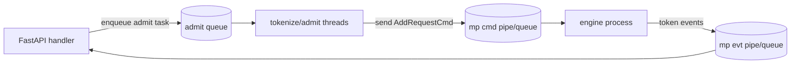

这一篇想做两件事：

1. **把 gap 讲清楚**：roseinfer 现在 online/offline 到底在哪些指标上比 vLLM 好、又在哪些指标上输给 SGLang / TensorRT-LLM？
2. **做增量试验**：不是“拍脑袋改一堆”，而是像做实验一样一个点一个点试（每个 feat 都有开关；确认正收益的我会逐步把默认打开），跑完就把数据和 profile 对上，判断是不是在往正确方向走。

我还是沿用项目里的 serving benchmark 形态：

- **trace stage**：回放真实 trace（`scale` 越小，负载越大）
- **profile stage**：单独采 profile（样本很小），避免 profile 污染 benchmark 数字

指标还是四个：

- TTFT：time-to-first-token
- ITL：inter-token latency
- TPOT：time per output token
- E2E：end-to-end latency

顺手把一个常用关系式写在这儿（输出 token 数为 $N$）：

$$
\mathrm{TPOT} = \frac{t_{end}-t_{first}}{N-1},\quad
\mathrm{E2E} = t_{end}-t_{start}
$$

---

## Baseline：先别优化，先把差距钉死

先看 online，一张总览图（包含 p50–p90 band、p90 线、p99 hollow）：


只看 P99 / P90 会更直观：


我把最重负载（`scale=0.4`）的原始数直接贴出来，避免“看图说话”：

| backend | TTFT p90 | TTFT p99 | TPOT p90 | TPOT p99 | E2E p90 | E2E p99 |
|---|---:|---:|---:|---:|---:|---:|
| roseinfer | 15.80 | 33.33 | 1.45 | 1.88 | 188.30 | 245.44 |
| vllm | 10.15 | 14.54 | 1.83 | 1.99 | 234.64 | 253.63 |
| sglang | 9.39 | 14.89 | 1.21 | 1.35 | 156.65 | 170.35 |
| trtllm | 6.30 | 8.03 | 1.44 | 1.90 | 187.42 | 193.03 |

<details>
<summary>online 原始数据（p50/p90/p99，全 scales）</summary>

- model: `gpt2`, dtype: `fp16`, `n=200`, scales: `[0.4, 0.8, 1.6]`
- versions: `git_rev=0cd08cb, rosellm=0.1.0, vllm=0.7.2, sglang=0.4.6, tensorrt_llm=1.1.0, torch=2.6.0, transformers=4.51.3, python=3.11.11`

| scale | backend | TTFT p50/p90/p99 (ms) | TPOT p50/p90/p99 (ms) | ITL p50/p90/p99 (ms) | E2E p50/p90/p99 (ms) |
|---:|---|---:|---:|---:|---:|
| 0.40 | roseinfer | 9.48/15.80/33.33 | 1.19/1.45/1.88 | 1.13/1.39/2.42 | 154.50/188.30/245.44 |
| 0.40 | SGLang | 7.80/9.39/14.89 | 1.10/1.21/1.35 | 1.07/1.28/2.85 | 144.13/156.65/170.35 |
| 0.40 | TensorRT-LLM | 5.82/6.30/8.03 | 1.40/1.44/1.90 | 1.40/1.53/2.62 | 182.62/187.42/193.03 |
| 0.40 | vLLM | 9.20/10.15/14.54 | 1.59/1.83/1.99 | 1.53/1.87/3.41 | 201.93/234.64/253.63 |
| 0.80 | roseinfer | 5.24/5.96/6.69 | 1.12/1.19/1.24 | 1.10/1.27/1.63 | 145.27/155.80/161.87 |
| 0.80 | SGLang | 8.63/9.83/14.13 | 1.07/1.15/1.27 | 1.06/1.21/2.02 | 142.70/149.64/160.67 |
| 0.80 | TensorRT-LLM | 5.71/6.28/6.90 | 1.39/1.41/1.51 | 1.38/1.50/2.02 | 181.14/184.33/188.56 |
| 0.80 | vLLM | 9.19/10.36/10.99 | 1.45/1.66/1.78 | 1.42/1.69/2.38 | 186.06/211.76/232.81 |
| 1.60 | roseinfer | 5.38/5.92/6.57 | 1.11/1.17/1.25 | 1.09/1.23/1.55 | 144.00/153.93/163.60 |
| 1.60 | SGLang | 8.87/9.98/14.93 | 1.06/1.16/1.34 | 1.05/1.20/2.02 | 142.46/151.47/166.25 |
| 1.60 | TensorRT-LLM | 5.88/6.43/7.02 | 1.38/1.41/1.53 | 1.38/1.50/1.86 | 180.76/184.17/199.04 |
| 1.60 | vLLM | 9.44/10.73/11.37 | 1.37/1.56/1.78 | 1.38/1.60/2.02 | 182.80/201.53/230.43 |

</details>

这张表里我看到三个很明确的信号：

- **TTFT 是我们的短板**：无论 p90/p99 都明显落后（尤其是 p99）。
- **TPOT/ITL 我们并不差**：TPOT p90 已经能压住 vLLM，p99 也差不多打平。
- **E2E 很“符合公式”**：TTFT 偏大 + TPOT 尚可，最后 E2E 能压住 vLLM，但和 SGLang/TRT 还有硬差距。

再看 offline（吞吐），同样先把现象钉死：


以及原始表格（同一组配置）：

| backend | req/s | output tok/s | total tok/s | total latency (s) |
|---|---:|---:|---:|---:|
| roseinfer | 201.14 | 12872.99 | 64364.95 | 0.64 |
| roseinfer (in-proc) | 204.01 | 13056.84 | 65284.22 | 0.63 |
| vllm | 140.44 | 8988.14 | 44940.70 | 0.91 |
| sglang | 243.20 | 15564.48 | 77822.40 | 0.53 |
| trtllm | 248.69 | 15916.24 | 79581.21 | 0.51 |

<details>
<summary>offline 原始数据（吞吐表）</summary>

- model: `gpt2`, dtype: `fp16`, `num_prompts=128`, `input_len=256`, `output_len=64`, `ignore_eos=true`
- versions: `git_rev=5099b2b, rosellm=0.1.0, vllm=0.7.2, sglang=0.4.6, torch=2.6.0, transformers=4.51.3, python=3.11.11`

| backend | req/s | output tok/s | total tok/s | total latency (s) |
|---|---:|---:|---:|---:|
| roseinfer | 201.14 | 12872.99 | 64364.95 | 0.636 |
| roseinfer (in-proc) | 204.01 | 13056.84 | 65284.22 | 0.627 |
| SGLang | 243.20 | 15564.48 | 77822.40 | 0.526 |
| TensorRT-LLM | 248.69 | 15916.24 | 79581.21 | 0.515 |
| vLLM | 140.44 | 8988.14 | 44940.70 | 0.911 |

</details>

offline 也很清晰：

- roseinfer **比 vLLM 快 40%+**（这点我挺满意，说明我们这套 paged decode + 融合内核没白做）。
- 但对上 SGLang / TRT-LLM **还差一截**（大概 15–20% 左右）。

---

## 拆指标：各家“好在哪 / 差在哪”

我这里按“最容易解释清楚”的顺序来：

### 1) TPOT / ITL：为什么我们能压 vLLM？

直觉上，TPOT/ITL 就是 decode 路径的“每 token 成本”。roseinfer 现在能把 vLLM 压住，核心是我们把 decode 的热路径尽量收敛成：

- paged attention 的 T=1 decode（避免 dense past_kv 的大张量搬运）
- CUDA graph replay（把 launch overhead 压到很低）
- fused sampler / fused KV append（减少 python->kernel 的切换次数）

这些东西不是“玄学”，都能在 torch profiler 的 trace 里看到对应的块（例如 `roseinfer.model.forward.cuda_graph_replay`、`roseinfer.mp.step`、`roseinfer.prefill_batch.model_forward` 等）。

### 2) TTFT：为什么 SGLang / TRT-LLM 更短？

TTFT 里面至少叠了三类开销：

1. **服务侧开销**：HTTP JSON parse、tokenize、请求入队/排队
2. **prefill 计算**：真正的 prefill forward
3. **调度等待**：prefill 何时开始跑、是否被 decode 轮转压住

TRT-LLM 低 TTFT 很容易理解：它把一大段推理图直接下沉到 TensorRT engine，prefill 的 kernel 组合就是更“硬”。

SGLang 的 TTFT 更短，除了 kernel 更紧凑以外，还和它的 serving 结构有关：它把 tokenize / scheduler / detokenize 拆得很清晰，避免把重 CPU 活塞进同一个 request handler 里（可以翻它的 server-side runtime 代码，整体思路非常工程化：把“会抖的 CPU 工作”从关键路径拿掉）。

为了避免写成本地路径，我把几个关键文件都换成可直接访问的 GitHub 链接（对应我这次对照的版本）：

- SGLang scheduler：<https://github.com/sgl-project/sglang/blob/ea177372bd8cb12fca335291e81ef049b8655472/python/sglang/srt/managers/scheduler.py>
- vLLM OpenAI server：<https://github.com/vllm-project/vllm/blob/7b5575fa7dcf76ac86ab8d18501b9cc04f74f6bb/vllm/entrypoints/openai/api_server.py>
- TensorRT-LLM examples（入口很多，我主要对照的是它的 serving/benchmark 脚本）：<https://github.com/NVIDIA/TensorRT-LLM/tree/7c82605327baf4ee12e8fd2cdd66fd3b87273928/examples>

### 3) offline 吞吐：为什么我们落后 SGLang / TRT-LLM？

offline 的 output tok/s，基本就是“decode token 的 steady-state 吞吐”。我们现在的 gap 更像“kernel 级别的常数项差距”：

- TRT-LLM：TensorRT engine + (可能的) 更激进 fusion
- SGLang：flashinfer/sgl-kernel 的组合把 decode 路径压得很干净
- roseinfer：虽然有不少 fusion，但整体还是 PyTorch eager + 自己拼 kernel，很多地方常数项还在（特别是 prefill / decode 的边角逻辑）

这一块短期最现实的路线还是：**继续把 kernel 和数据流压平**，而不是指望 scheduler 改一改就把吞吐追平。

---

## Feat1：mpasync（默认开启，把 admit/tokenize 从 handler 拆出去）

### 动机

TTFT 的服务侧开销里，“tokenize + 提交请求”是个很典型的 CPU 热点：

- 在 FastAPI handler 里同步做 tokenize，会把 event loop/worker 卡住（哪怕 tokenize 本身不慢，抖动也会被放大到 tail）。
- SGLang 这种把 pipeline 拆开的方案，本质上就是在说：**把 CPU 工作挪出关键路径**。

所以我做了一个很直接的试验：在 multiprocess 模式下新增一个 admission 阶段，把：

- prompt tokenize
- AddRequestCmd 的提交

从 FastAPI handler 里拆出去，让 handler 更像一个“轻薄的入口”。

实现对应这两个开关（默认开启）：

- `--mp-async-admit/--no-mp-async-admit`
- `--mp-tokenize-workers N`（默认 `4`）

### 实现

代码入口：

- `rosellm/roseinfer/mp.py`：`MPSchedulerManager(... async_admit, tokenize_workers)`
- `rosellm/roseinfer/server.py`：把这两个参数接到 CLI 上

大致数据流可以理解成这样：



### 结果（online）


P99 / P90：


把 `scale=0.4` 的数字贴出来：

| backend | TTFT p90 | TTFT p99 | TPOT p90 | TPOT p99 | E2E p90 | E2E p99 |
|---|---:|---:|---:|---:|---:|---:|
| roseinfer | 15.80 | 33.33 | 1.45 | 1.88 | 188.30 | 245.44 |
| roseinfer (-mp async admit) | 16.00 | 27.43 | 1.52 | 1.99 | 198.34 | 260.21 |
| vllm | 10.15 | 14.54 | 1.83 | 1.99 | 234.64 | 253.63 |
| sglang | 9.39 | 14.89 | 1.21 | 1.35 | 156.65 | 170.35 |
| trtllm | 6.30 | 8.03 | 1.44 | 1.90 | 187.42 | 193.03 |

<details>
<summary>online 原始数据（p50/p90/p99，全 scales）</summary>

- model: `gpt2`, dtype: `fp16`, `n=200`, scales: `[0.4, 0.8, 1.6]`
- versions: `git_rev=0cd08cb, rosellm=0.1.0, vllm=0.7.2, sglang=0.4.6, tensorrt_llm=1.1.0, torch=2.6.0, transformers=4.51.3, python=3.11.11`

| scale | backend | TTFT p50/p90/p99 (ms) | TPOT p50/p90/p99 (ms) | ITL p50/p90/p99 (ms) | E2E p50/p90/p99 (ms) |
|---:|---|---:|---:|---:|---:|
| 0.40 | roseinfer | 9.48/15.80/33.33 | 1.19/1.45/1.88 | 1.13/1.39/2.42 | 154.50/188.30/245.44 |
| 0.40 | roseinfer (-mp async admit) | 9.75/16.00/27.43 | 1.35/1.52/1.99 | 1.28/1.52/2.74 | 173.78/198.34/260.21 |
| 0.40 | SGLang | 7.80/9.39/14.89 | 1.10/1.21/1.35 | 1.07/1.28/2.85 | 144.13/156.65/170.35 |
| 0.40 | TensorRT-LLM | 5.82/6.30/8.03 | 1.40/1.44/1.90 | 1.40/1.53/2.62 | 182.62/187.42/193.03 |
| 0.40 | vLLM | 9.20/10.15/14.54 | 1.59/1.83/1.99 | 1.53/1.87/3.41 | 201.93/234.64/253.63 |
| 0.80 | roseinfer | 5.24/5.96/6.69 | 1.12/1.19/1.24 | 1.10/1.27/1.63 | 145.27/155.80/161.87 |
| 0.80 | roseinfer (-mp async admit) | 5.14/6.20/7.04 | 1.27/1.35/1.38 | 1.24/1.42/1.78 | 162.81/175.66/179.54 |
| 0.80 | SGLang | 8.63/9.83/14.13 | 1.07/1.15/1.27 | 1.06/1.21/2.02 | 142.70/149.64/160.67 |
| 0.80 | TensorRT-LLM | 5.71/6.28/6.90 | 1.39/1.41/1.51 | 1.38/1.50/2.02 | 181.14/184.33/188.56 |
| 0.80 | vLLM | 9.19/10.36/10.99 | 1.45/1.66/1.78 | 1.42/1.69/2.38 | 186.06/211.76/232.81 |
| 1.60 | roseinfer | 5.38/5.92/6.57 | 1.11/1.17/1.25 | 1.09/1.23/1.55 | 144.00/153.93/163.60 |
| 1.60 | roseinfer (-mp async admit) | 5.18/5.92/6.62 | 1.26/1.34/1.41 | 1.23/1.38/1.70 | 160.91/172.25/184.12 |
| 1.60 | SGLang | 8.87/9.98/14.93 | 1.06/1.16/1.34 | 1.05/1.20/2.02 | 142.46/151.47/166.25 |
| 1.60 | TensorRT-LLM | 5.88/6.43/7.02 | 1.38/1.41/1.53 | 1.38/1.50/1.86 | 180.76/184.17/199.04 |
| 1.60 | vLLM | 9.44/10.73/11.37 | 1.37/1.56/1.78 | 1.38/1.60/2.02 | 182.80/201.53/230.43 |

</details>

这组数据的结论非常“拧巴”：

- **TPOT / E2E 变好**（尤其是 E2E p99 明显掉了一截）
- 但 **TTFT p99 变差**（在最重负载下，长尾更难看）

我理解它的本质不是“算得更慢”，而是**排队形态变了**：

- baseline：handler 同步 tokenize，会天然形成 backpressure，系统很早就开始“堵住”，但进入系统的请求 TTFT 不一定变差。
- mpasync：入口更轻，更多请求能更快进入 admission 队列；在重负载下，tokenize/admit 线程会被打满，TTFT 的 tail 变成“在队里等”的 tail。

所以这个 feat 的价值更像是：**给 TPOT/E2E 让路**，但它并不是“TTFT tail 的银弹”。它带来的收益足够实在（尤其是 E2E），所以我把它默认打开；如果你特别在意 TTFT p99，可以手动 `--no-mp-async-admit`。

### 结果（offline）

offline 本身不走 HTTP handler，也不做 prompt tokenize（直接用 token ids），所以这个 feat 对 offline 吞吐基本是“无效”的：图我就不重复解释了。


<details>
<summary>offline 原始数据（吞吐表）</summary>

mpasync 开关对 offline 不生效（offline 直接喂 token ids，不走 handler/tokenize），所以这张表就是 baseline。

| backend | req/s | output tok/s | total tok/s | total latency (s) |
|---|---:|---:|---:|---:|
| roseinfer | 201.14 | 12872.99 | 64364.95 | 0.636 |
| roseinfer (in-proc) | 204.01 | 13056.84 | 65284.22 | 0.627 |
| SGLang | 243.20 | 15564.48 | 77822.40 | 0.526 |
| TensorRT-LLM | 248.69 | 15916.24 | 79581.21 | 0.515 |
| vLLM | 140.44 | 8988.14 | 44940.70 | 0.911 |

</details>

---

## Feat2：+auto2（prefill backend 改成 flash-attn 优先）

### 动机

TTFT 慢，第一反应就是 prefill 慢。

roseinfer 的 prefill backend `auto` 目前是 **flashinfer 优先**（如果装了 flashinfer）。我想验证一个简单假设：

> 对 GPT-2 这种 dense prefill，flash-attn 可能更合适？如果把 auto 的优先级换一下，会不会 TTFT 变短、offline 也更快？

于是加了一个新枚举值 `auto2`（默认还是 `auto`，所以这个也是“默认关闭”的试验项）：

- `auto`：flashinfer -> flash-attn
- `auto2`：flash-attn -> flashinfer

实现位置：

- `rosellm/roseinfer/engine.py`：`_resolve_prefill_backend()` 支持 `auto2`
- `rosellm/roseinfer/server.py` / `benchmarks/serving/*_compare.py`：放开 `auto2` 作为合法参数

### 结果（online）

这个试验我刻意用 `--no-mp-async-admit` 跑：mpasync 会改变排队形态（TTFT tail 的来源变了），很容易把 prefill backend 的差异“淹没”掉。


P99 / P90：


只看 `scale=0.4` 的表格更直观：

| backend | TTFT p90 | TTFT p99 | TPOT p90 | TPOT p99 | E2E p90 | E2E p99 |
|---|---:|---:|---:|---:|---:|---:|
| roseinfer (-mp async admit) | 16.00 | 27.43 | 1.52 | 1.99 | 198.34 | 260.21 |
| roseinfer (prefill auto2, -mp async admit) | 15.89 | 27.68 | 1.52 | 2.02 | 198.24 | 260.69 |
| vllm | 10.15 | 14.54 | 1.83 | 1.99 | 234.64 | 253.63 |
| sglang | 9.39 | 14.89 | 1.21 | 1.35 | 156.65 | 170.35 |
| trtllm | 6.30 | 8.03 | 1.44 | 1.90 | 187.42 | 193.03 |

<details>
<summary>online 原始数据（p50/p90/p99，全 scales）</summary>

- model: `gpt2`, dtype: `fp16`, `n=200`, scales: `[0.4, 0.8, 1.6]`
- versions: `git_rev=0cd08cb, rosellm=0.1.0, vllm=0.7.2, sglang=0.4.6, tensorrt_llm=1.1.0, torch=2.6.0, transformers=4.51.3, python=3.11.11`

| scale | backend | TTFT p50/p90/p99 (ms) | TPOT p50/p90/p99 (ms) | ITL p50/p90/p99 (ms) | E2E p50/p90/p99 (ms) |
|---:|---|---:|---:|---:|---:|
| 0.40 | roseinfer (prefill auto2, -mp async admit) | 9.66/15.89/27.68 | 1.34/1.52/2.02 | 1.28/1.52/2.93 | 174.02/198.24/260.69 |
| 0.40 | roseinfer (-mp async admit) | 9.75/16.00/27.43 | 1.35/1.52/1.99 | 1.28/1.52/2.74 | 173.78/198.34/260.21 |
| 0.40 | SGLang | 7.80/9.39/14.89 | 1.10/1.21/1.35 | 1.07/1.28/2.85 | 144.13/156.65/170.35 |
| 0.40 | TensorRT-LLM | 5.82/6.30/8.03 | 1.40/1.44/1.90 | 1.40/1.53/2.62 | 182.62/187.42/193.03 |
| 0.40 | vLLM | 9.20/10.15/14.54 | 1.59/1.83/1.99 | 1.53/1.87/3.41 | 201.93/234.64/253.63 |
| 0.80 | roseinfer (prefill auto2, -mp async admit) | 5.04/6.07/6.67 | 1.27/1.35/1.38 | 1.24/1.42/1.76 | 161.70/174.42/178.10 |
| 0.80 | roseinfer (-mp async admit) | 5.14/6.20/7.04 | 1.27/1.35/1.38 | 1.24/1.42/1.78 | 162.81/175.66/179.54 |
| 0.80 | SGLang | 8.63/9.83/14.13 | 1.07/1.15/1.27 | 1.06/1.21/2.02 | 142.70/149.64/160.67 |
| 0.80 | TensorRT-LLM | 5.71/6.28/6.90 | 1.39/1.41/1.51 | 1.38/1.50/2.02 | 181.14/184.33/188.56 |
| 0.80 | vLLM | 9.19/10.36/10.99 | 1.45/1.66/1.78 | 1.42/1.69/2.38 | 186.06/211.76/232.81 |
| 1.60 | roseinfer (prefill auto2, -mp async admit) | 5.09/5.85/6.82 | 1.26/1.34/1.43 | 1.23/1.40/1.69 | 160.94/173.84/185.32 |
| 1.60 | roseinfer (-mp async admit) | 5.18/5.92/6.62 | 1.26/1.34/1.41 | 1.23/1.38/1.70 | 160.91/172.25/184.12 |
| 1.60 | SGLang | 8.87/9.98/14.93 | 1.06/1.16/1.34 | 1.05/1.20/2.02 | 142.46/151.47/166.25 |
| 1.60 | TensorRT-LLM | 5.88/6.43/7.02 | 1.38/1.41/1.53 | 1.38/1.50/1.86 | 180.76/184.17/199.04 |
| 1.60 | vLLM | 9.44/10.73/11.37 | 1.37/1.56/1.78 | 1.38/1.60/2.02 | 182.80/201.53/230.43 |

</details>

online 上基本可以判死刑：**变化非常小，且 p99 没有任何改善**。

### 结果（offline）

offline benchmark 我现在把口径统一成 fixed-length generation（`ignore_eos=true`），避免因为 EOS 早停导致“输出长度随机 → 吞吐口径漂移”。这条 `auto2` 的 offline 数据是旧口径跑的，为了避免再画一张不可比的图，这里先不贴。

所以 `auto2` 我会留着当实验开关，但默认永远不应该开（至少从 online 看它没有带来任何好处）。

---

## Profile 怎么看（以及文件在哪）

### 1) 先找文件

每次 profile stage 都会写一个 `profile_manifest.json`，里面把每个 backend 的 profile 输出目录写死了。

典型路径长这样：

- online baseline profile（torch/nsys，mpasync 开）：`outputs/benchmarks/serving/online_20251230_111520/profile_manifest.json`
- online baseline profile（torch/nsys，mpasync 关）：`outputs/benchmarks/serving/online_20251230_140544/profile_manifest.json`
- online auto2 profile（torch/nsys，mpasync 关）：`outputs/benchmarks/serving/online_20251230_135311/profile_manifest.json`
- offline baseline profile（torch/nsys）：`outputs/benchmarks/serving/offline_20251229_001108/profile_manifest.json`

对具体文件来说：

- torch profiler：`profiles/torch/<backend>/trace.json`
- nsys report：`profiles/nsys/<backend>/nsys.nsys-rep`

需要 `.sqlite` 的话可以手动 export：

```bash
nsys stats --force-export=true --report cuda_gpu_sum path/to/nsys.nsys-rep
```

### 2) torch profiler：我主要看三件事

- **prefill 的 forward**：`roseinfer.prefill_batch.model_forward`
- **decode 的 steady state**：`roseinfer.model.forward.cuda_graph_replay` / `roseinfer.mp.step`
- **CPU 侧的噪声**：tokenize、IPC、queue wakeup（尤其是 TTFT tail 的时候）

这套 trace 的好处是：即便你开了 CUDA graphs，它也能把 CPU 侧的 record_function / NVTX 范围显示得很清楚。

### 3) nsys：我主要用它看“线程和调度”

vLLM/SGLang/TRT-LLM 的 nsys 一般能直接看到 kernel；roseinfer 这边因为 decode 用了 CUDA graph，nsys 的展示形式会更偏向 graph/events + NVTX ranges（这点在 CLI report 上不太友好，但 GUI 里能看）。

我自己的用法：

- 先用 NVTX 找到 TTFT 的时间窗（`nvtx_sum` / GUI 里范围）
- 再对比：
  - prefill 段 GPU 是否被拉长
  - CPU 线程是否在 poll/read/cond_wait 上出现长空洞（典型的 handler/queue 抖动）

---

## 小结：现在“最该打的点”是什么？

把这篇的结论收束一下：

- roseinfer 目前的 decode（TPOT/ITL）已经能压住 vLLM，这是好消息。
- TTFT 仍然明显落后 SGLang/TRT-LLM，说明 prefill/scheduler/服务侧路径还有硬差距。
- mpasync 默认开启：能改善 TPOT/E2E，但在重负载下会把 tail 形态转成 admission queue tail；它更像“吞吐/稳定性”的工具，不是 TTFT tail 的解法。
- `+auto2` 变化非常小，p99 没有改善，这条路可以先放。

下一步我会把注意力集中到 **TTFT 的硬差距** 上：prefill 的 kernel 组合、prefill batching 策略、以及更细粒度的调度公平性（不要让 prefill 被 decode 轮转压住）。这才是把 roseinfer 拉到 SGLang/TRT-LLM 水平的关键。
